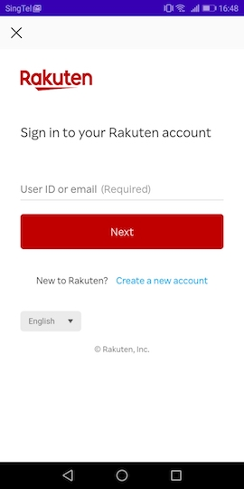

[TOP](/README.md#top)　>　[Basic Guide](./README.md)　>　Login  

---  

# Login
This is for external login options (RAKUTEN_AUTH).  
If you use Rakuten Login SDK, you don't need to use this option.  

## Activity class
### 1. Show Login Page

```kotlin
RakutenAuth.openLoginPage(context, REQUEST_THIRD_PARTY_LOGIN)
```


### 2. Get result from `onActivityResult()`
```kotlin
override fun onActivityResult(requestCode: Int, resultCode: Int, data: Intent?) {
    if (requestCode == REQUEST_THIRD_PARTY_LOGIN) {
        if (resultCode == RESULT_OK) {
            handleActivityResult(data)
        } else {
            //login canceled by user
        }
    }
}
```

### 3. Process result intent to complete login flow by calling `RakutenAuth.handleActivityResult()`
```kotlin
private fun handleActivityResult(data: Intent?) {
    RakutenAuth.handleActivityResult(data, object : LoginResultCallback {
        override fun loginSuccess() {
            //✅ login completed
        }

        override fun loginFailed(e: RakutenRewardAPIError) {
            //⛔ login failed
        }
    })
}
```
<details>
    <summary>JAVA</summary>

```java
RakutenAuth.handleActivityResult(null, new LoginResultCallback() {
    @Override
    public void loginSuccess() {
        //✅ login completed
    }

    @Override
    public void loginFailed(@NonNull RakutenRewardAPIError rakutenRewardAPIError) {
        //⛔ login failed
    }
});
```    
</details>  

## Fragment class
[](/doc/history/README.md#version-241)

You can call `RakutenAuth.openLoginPage()` API in Fragment class by providing the Fragment reference.  
`onActivityResult()` will be triggered in the Fragment class. 

## AndroidX Activity Result API
[](https://github.com/rakuten-ads/Rakuten-Reward-Native-Android/releases/tag/rel_20221202_v3_4_2)

`startActivityForResult` and `onActivityResult` has been deprecated since Android 11 (API 30). So we provide a new API which uses AndroidX Activity Result API to get Activity result.  
In order to use the Activity Result API the following dependency is required.  
```groovy
androidx.activity:activity:1.2.0 //1.2.0 or later
//or
androidx.activity:activity-ktx:1.2.0 //1.2.0 or later
```

Use the following API and provide a `ActivityResultCallback<ActivityResult>`
```kotlin
RakutenAuth.openLoginPage(context) { result ->
    if (result.resultCode == RESULT_OK) {
        // call handleActivityResult when result code is OK
        RakutenAuth.handleActivityResult(result.data, object : LoginResultCallback {
            override fun loginSuccess() {
                //✅ login completed
            }

            override fun loginFailed(e: RakutenRewardAPIError) {
                //⛔ login failed
            }
        })
    }
}
```  
<details>
    <summary>JAVA</summary>

```java
RakutenAuth.openLoginPage(this, result -> {
    if (result.resultCode == RESULT_OK) {
        // call handleActivityResult when result code is OK
        RakutenAuth.handleActivityResult(null, new LoginResultCallback() {
            @Override
            public void loginSuccess() {
                //✅ login completed
            }

            @Override
            public void loginFailed(@NonNull RakutenRewardAPIError rakutenRewardAPIError) {
                //⛔ login failed
            }
        });
    }
});
```    
</details>  

> This API can be call in Activity or Fragment class, but require Activity context.  

<br>  

---
LANGUAGE :
> [](../ja/basic/LOGIN.md)