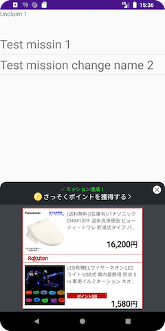

[TOP](/README.md#top)　>　[Basic Guide](./README.md)　>　Mission Achievement  

---  
  
# Mission Achievement  
To achieve a mission, developers need to call post action API.  
After achieving the mission, a notification will be shown.  

## Post Action  
### Kotlin
```kotlin
RakutenReward.logAction("<actionCode>", {
    // post action success
}, {
    // post action failed
})
```  
### JAVA
```java
RakutenReward.logActionJava("<actionCode>", new LogActionCallback() {
    @Override
    public void success() {

    }

    @Override
    public void fail(@NonNull RakutenRewardAPIError rakutenRewardAPIError) {

    }
});
```  
### Coroutine  
[](https://github.com/rakuten-ads/Rakuten-Reward-Native-Android/releases/tag/rel_20220826_v3_3_0)  
```kotlin
val result = RakutenRewardCoroutine.logAction("<actionCode>")
```  
`actionCode` is provided by Reward SDK Developer Portal.  

<br>  

## Notification UI  
Once user achieved the mission, a notification UI will be shown.  
Reward SDK provides Modal, Banner, and Ad Banner UI  

     

     

### Notification Type
There  are 6 types of Mission Achievement UI. Modal, Banner, Small Ad Banner, Big Ad Banner, and No UI, and Custom which developed by developers.

You can decide the type by Developer Portal 

| Notification Type | UI                                    |
|-------------------|---------------------------------------|
| Modal             | Show Modal UI provided by SDK         |
| Banner            | Show Banner UI provided by SDK        |
| Small Ad Banner   | Show Ad Banner UI provided by SDK     |
| Big Ad Banner     | Show Ad Banner UI provided by SDK     |
| Custom            | Developer can create UI by themselves |
| No UI             | Not show any UI                       |

### Disable Notification UI  
Reward SDK provide a configuration to disable notifcation UI.  
```kotlin
RakutenRewardConfig.setUiEnabled(false)
```  

<br>

## Claim Point
After notification UI is shown, user have to tap on the UI to claim the point.  
Then a claim point UI will be shown to show the status.  

  

### CUSTOM notification type  
For Custom notifcation type, developers need to create UI by themselves and decide when user can claim the point.  

`onUnclaimedAchievement` in `RakutenRewardListener` will be triggered when a mission is achieved.  
```kotlin
override fun onUnclaimedAchievement(achievement: MissionAchievementData) {
    if (achievement.custom // check is notification type CUSTOM
        && RakutenRewardConfig.isUiEnabled() // check if user enable the UI setting
    ) {
        // Show custom UI in MAIN thread
    }
}
```

Then call the `claim()` API of the `MissionAchievementData` object return in `onUnclaimedAchievement`.   
```kotlin
achievement.claim({
    // claim success
}, {
    // claim failed
})
```  
<details>
    <summary>JAVA</summary>  

```java
achievement.claimJava(new CustomClaimCallback() {
    @Override
    public void success(@NonNull MissionAchievementData missionAchievementData) {
        
    }

    @Override
    public void fail(@NonNull RakutenRewardAPIError rakutenRewardAPIError) {

    }
});
```
</details>  

<br>

---
LANGUAGE :
> [](../ja/basic/MissionAchivement.md)