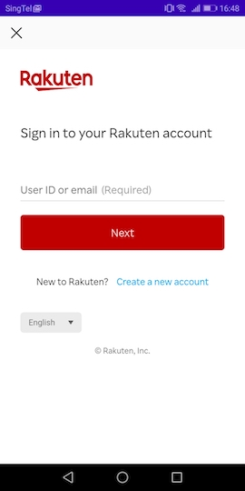
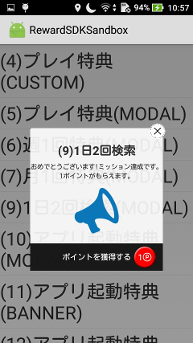
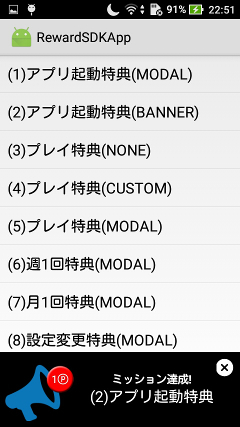
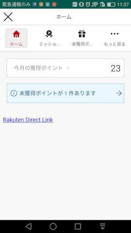
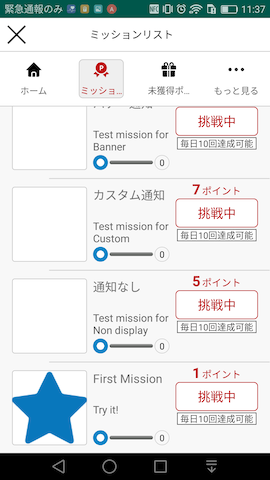
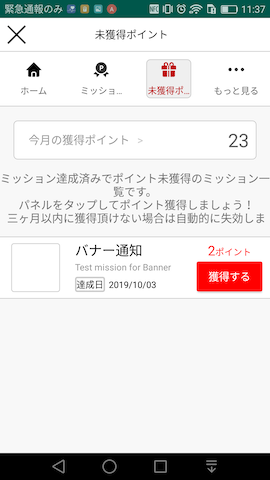
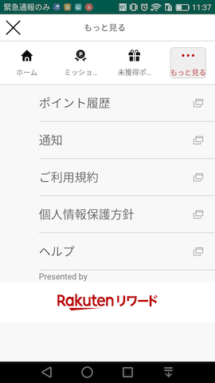
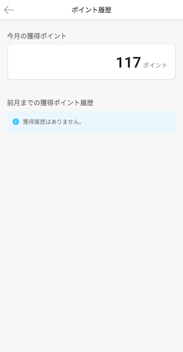

[TOP](../../README.md#top)　>　Basic Guide

---
# Initialize SDK
### Initialize SDK in your Application class with your `App Code`.
```kotlin
class App: Application() {

    override fun onCreate() {
        super.onCreate()
        //init sdk with your App Code
        RakutenReward.init(this, "<AppCode>")
    }
}
```

| Parameter name        | Description           
| --- | --- 
| AppCode | Application Key (This is from Rakuten Reward Developer Portal)

<br><br/>
### To start SDK in your Activity, we provide several ways:

### Option 1. Extends RakutenRewardBaseActivity
```kotlin
class YourActivity : RakutenRewardBaseActivity() {}
```
(If you are not able to extend RakutenRewardBaseActivity, use method 2 and 3)
### Option 2. Call Lifecycle Method in each Android Lifecycle
```kotlin
class YourActivity : Activity() {

    override fun onCreate(savedInstanceState: Bundle?) {
        super.onCreate(savedInstanceState)
        RakutenRewardLifecycle.onCreate(this)
    }

    override fun onStart() {
        super.onStart()
        RakutenRewardLifecycle.onStart(this)
    }

    override fun onDestroy() {
        super.onDestroy()
        RakutenRewardLifecycle.onDestroy()
    }
}
```

### Option 3. Call AndroidX base lifecycle method
```kotlin
class YourActivity : AppCompatActivity() {

    override fun onCreate(savedInstanceState: Bundle?) {
        super.onCreate(savedInstanceState)
        RakutenRewardManager.bindRakutenRewardIn(this, this)
    }
}
```

---
# Login

### 1. Start and display login page with `RakutenAuth.openLoginPage()`
```kotlin
RakutenAuth.openLoginPage(context, REQUEST_THIRD_PARTY_LOGIN)
```



### 2. Get result from `onActivityResult()`
```kotlin
override fun onActivityResult(requestCode: Int, resultCode: Int, data: Intent?) {
        if (requestCode == REQUEST_THIRD_PARTY_LOGIN) {
            if (resultCode == RESULT_OK) {
                handleActivityResult(data)
            } else {
                //login canceled by user
            }
        }
    }
```

### 3. Process result intent to complete login flow by calling `RakutenAuth.handleActivityResult()`
```kotlin
private fun handleActivityResult(data: Intent?) {
        RakutenAuth.handleActivityResult(data, object : LoginResultCallback {
            override fun loginSuccess() {
                //✅ login completed
            }

            override fun loginFailed(e: RakutenRewardAPIError) {
                //⛔ login failed
            }
        })
    }
```

---
# Logout
Log user out by calling `RakutenAuth.logout()`
```kotlin
private fun logout() {
    RakutenAuth.logout(object : LogoutResultCallback {
            override fun logoutSuccess() {
                //logout completed
            }

            override fun logoutFailed(e: RakutenRewardAPIError) {
                //login failed
            }
        })
}
```

---
# Get User Info

List of available api to retrieve user information

## Check if user is signed in
```kotlin
RakutenAuth.hasUserSignedIn(): Boolean
```

## Get user's full name
```kotlin
RakutenAuth.getUserName(context: Context): String
```

## Get user's current point and rank
```kotlin
RakutenAuth.getUserInfo(
    success = { userInfo ->
        //get point
        userInfo.points
        
        //get rank
        userInfo.rank
    }, 
    failed = {
        //fail to get user info
    }
)
```
---
# Mission Achievement 
To achieve mission, developers need to call post action API.  
After avhieving the mission, notification will be shown.  

## Post Action
```kotlin
RakutenReward.logAction("<actionCode>", {}, {})
```
actionCode is provided by Reward SDK Developer Portal.  

## Notification UI
The user achieved the mission, notification UI is shown.  
Reward SDK provides Modal and Banner UI

     

### Notification Type
There  are 4 types of Mission Achievement UI. Modal, Banner, and No UI, and Custom which developed by developers.

You can decide type by Developer Portal 

| Notification Type        | UI
| --- | ---
| Modal | Show Modal UI provided by SDK
| Banner | Show Banner UI provided by SDK
| Custom | Developer can create UI by themselves
| No UI | Not show any UI

## SDK Portal
We provide User Portal UI for developers. To call Open SDK Portal API, developers can see user status (mission, unclaim list, current point, point history etc...)

This is UI Image











---
LANGUAGE :
> [](../ja/basic/README.md)
