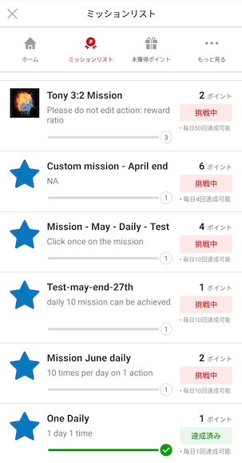
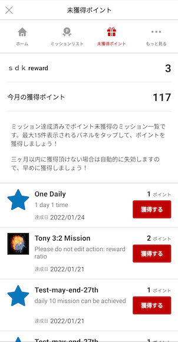

[TOP](../../README.md#top)　>　Basic Guide

---
# Initialize SDK
To use Reward SDK, need to establish SDK session at first (to collect SDK user's basic information)  
Before start session, need to set following information in RakutenReward class.  

```kotlin
RakutenReward.token = "<accesstoken>"
RakutenReward.appCode = "<AppCode>"  // Example anAuY28ucmFrdXRlbi5yZXdhcmQuYW5kcm9pZC1sRUdqNEhETS1pdXNZbWRLT2JVRGFLVV9fQ0ZLd2lacg==

```

| Parameter name        | Description           
| --- | --- 
| appCode | Application Key (This is from Rakuten Reward Developer Portal) 
| token | Access token to access Reward SDK API-C API |

Session starts in OnStart method in Activity  
To initialize SDK, SDK provides several ways  

### 1 Extends RakutenRewardLightBaseActivity
```kotlin
class YourActivity : RakutenRewardBaseActivity {}
```

### 2 Call Lifecycle Method in each Android Lifecycle
```kotlin
class YourActivity : Activity() {

    override fun onCreate(savedInstanceState: Bundle?) {
        super.onCreate(savedInstanceState)
        RakutenRewardLifecycle.onCreate(this)
    }

    override fun onStart() {
        super.onStart()
        RakutenRewardLifecycle.onStart(this)
    }

    override fun onDestroy() {
        super.onDestroy()
        RakutenRewardLifecycle.onDestroy()
    }
}
```


### 3 Call AndroidX base lifecycle method
```kotlin
class YourActivity : AppCompatActivity() {

    override fun onCreate(savedInstanceState: Bundle?) {
        super.onCreate(savedInstanceState)
        RakutenRewardManager.bindRakutenRewardIn(this, this)
    }

}
```

To use this way, your Activity support LifecycleOwner.

## Initialization Flow with IDSDK
1. Login with ID SDK
2. Get Access token from CAT API 
3. Set access token to Reward SDK
4. Initialize Reward SDK

We have options to use User SDK in Rakuten(2020/06), more details  
Please ask SDK team.

---
# Mission Achievement 
To achieve mission, developers need to call post action API.  
After avhieving the mission, notification will be shown.  

## Post Action
```kotlin
RakutenReward.logAction("<actionCode>", {}, {})
```
actionCode is provided by Reward SDK Developer Portal.  

## Notification UI
The user achieved the mission, notification UI is shown.  
Reward SDK provides Modal and Banner UI

     

### Notification Type
There  are 4 types of Mission Achievement UI. Modal, Banner, and No UI, and Custom which developed by developers.

You can decide type by Developer Portal 

| Notification Type        | UI
| --- | ---
| Modal | Show Modal UI provided by SDK
| Banner | Show Banner UI provided by SDK
| Custom | Developer can create UI by themselves
| No UI | Not show any UI

## SDK Portal
We provide User Portal UI for developers. To call Open SDK Portal API, developers can see user status (mission, unclaim list, current point, point history etc...)

This is UI Image







---
LANGUAGE :
> [](../ja/basic/README.md)
