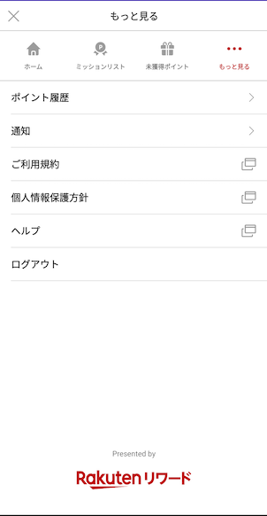

[TOP](../../README.md#top)　>　Basic Guide

Table of Contents
* [Authentication](#authentication)<br>
  * [Login Options](#login-options)<br>
  * [Log in](#log-in)<br>
  * [Log out](#log-out)<br>
* [Initialize SDK](#initialize-sdk)<br>
* [Getting User Information](#getting-user-information)<br>
* [Mission Achievement](#mission-achievement)<br>
* [SDK Portal](#sdk-portal)<br>
* [Ad Portal](#ad-portal-from-version-2.4.0)<br>
* [SDK Debugging Log](#sdk-debugging-log)<br>
* [Coroutine Support](#coroutine-support)<br><br>

---
# Authentication

## Login Options
There are 3 types of login. According to your environment, please select proper one. 
<br>

| Login Option        | Description | Support |
| --- | --- | --- |
| RakutenAuth | This is default option, provide login by SDK, SDK handled all login and user identifier | Japan, Taiwan |
| RID | Rakuten ID SDK with RID, Login covers by ID SDK, and use API token for SDK| Japan |  
| RAE | Rakuten ID SDK with RAE, Login covers by ID SDK, and use token for SDK | Japan |
<br>

### Switch Login Option
By default, login option is RakutenAuth
<br>

### RakutenAuth
```kotlin
RakutenReward.tokenType = RakutenRewardTokentype.RAKUTEN_AUTH
```
<br>

### RID
```kotlin
RakutenReward.tokenType = RakutenRewardTokentype.RID
```
To use SDK API, need to set API (API-C) token by developers  
```kotlin
RakutenReward.setRIdToken("token")
```

For login implementation, please read SDK login documentation.

> :grey_exclamation:  **From version 3.1.1, developers require to call logout API whenever user log out to properly clear token and data**

Refer to [Log Out](#log-out)

### RAE
```kotlin
RakutenReward.tokenType = RakutenRewardTokentype.RAE
```

To use SDK API, need to set access API token by developers
```kotlin
RakutenReward.setRaeToken("token")
```

For login implementation, please read SDK login documentation.

> :grey_exclamation:  **From version 3.1.1, developers require to call logout API whenever user log out to properly clear token and data**

Refer to [Log Out](#log-out)

# Log in
### 1. Show Login Page
This is for external login options,
If you use Rakuten Login SDK, you don't need to use this option.

```kotlin
RakutenAuth.openLoginPage(context, REQUEST_THIRD_PARTY_LOGIN)
```


### 2. Get result from `onActivityResult()`
```kotlin
override fun onActivityResult(requestCode: Int, resultCode: Int, data: Intent?) {
    if (requestCode == REQUEST_THIRD_PARTY_LOGIN) {
        if (resultCode == RESULT_OK) {
            handleActivityResult(data)
        } else {
            //login canceled by user
        }
    }
}
```

### 3. Process result intent to complete login flow by calling `RakutenAuth.handleActivityResult()`
```kotlin
private fun handleActivityResult(data: Intent?) {
    RakutenAuth.handleActivityResult(data, object : LoginResultCallback {
        override fun loginSuccess() {
            //✅ login completed
        }

        override fun loginFailed(e: RakutenRewardAPIError) {
            //⛔ login failed
        }
    })
}
```

### **Call the API in Fragment class**
From version 2.4.1 onwards, you can call `RakutenAuth.openLoginPage()` API in Fragment class by providing the Fragment reference instead of Activity reference. 
`onActivityResult()` will be triggered in the Fragment class. 

### **From version 3.4.2**
Androidx Activity Result API is used to get Activity result, instead of using deprecated `startActivityForResult` and `onActivityResult`.

Use the following API and provide a `ActivityResultCallback<ActivityResult>`
```kotlin
RakutenAuth.openLoginPage(context) { result ->
    if (result.resultCode == RESULT_OK) {
        RakutenAuth.handleActivityResult(result.data, object : LoginResultCallback {
            override fun loginSuccess() {
                //✅ login completed
            }

            override fun loginFailed(e: RakutenRewardAPIError) {
                //⛔ login failed
            }
        })
    }
}
```
> This API can be call in Activity or Fragment class, but require Activity context.

# Log out
Logging user out: 

```kotlin
private fun logout() {
    RakutenAuth.logout(object : LogoutResultCallback {
        override fun logoutSuccess() {
            //logout completed
        }

        override fun logoutFailed(e: RakutenRewardAPIError) {
            //login failed
        }
    })
}
```


# Initialize SDK
### Initialize SDK in your Application class with your `App Code`.
```kotlin
class App: Application() {

    override fun onCreate() {
        super.onCreate()
        //init sdk with your App Code
        RakutenReward.init(this, "<AppCode>")
    }
}
```

| Parameter name        | Description           
| --- | --- 
| AppCode | Application Key (This is from Rakuten Reward Developer Portal)

If you use RAE, RID option, you need to set token to activate SDK.
<br/><br/>

### **\*From version 3.3.0 onward, manual initialization is no longer needed.**
Set your `App Code` in your application's AndroidManifest.xml as follow:
```xml
<application>
    <!-- Reward SDK Application Key -->
    <meta-data
        android:name="com.rakuten.gap.ads.mission_core.appKey"
        android:value="{Application Key}"/>
</application>
```


<br><br/>

### To start SDK in your Activity, we provide several ways:

### Option 1. Extends RakutenRewardBaseActivity
```kotlin
class YourActivity : RakutenRewardBaseActivity() {}
```
(If you are not able to extend RakutenRewardBaseActivity, use method 2 and 3)
### Option 2. Call Lifecycle Method in each Android Lifecycle
```kotlin
class YourActivity : Activity() {

    override fun onCreate(savedInstanceState: Bundle?) {
        super.onCreate(savedInstanceState)
        RakutenRewardLifecycle.onCreate(this)
    }

    override fun onStart() {
        super.onStart()
        RakutenRewardLifecycle.onStart(this)
    }

    override fun onResume() {
        RakutenRewardLifecycle.onResume(this)
    }

    override fun onDestroy() {
        super.onDestroy()
        RakutenRewardLifecycle.onDestroy()
    }
}
```

### Option 3. Call AndroidX base lifecycle method
```kotlin
class YourActivity : AppCompatActivity() {

    override fun onCreate(savedInstanceState: Bundle?) {
        super.onCreate(savedInstanceState)
        RakutenRewardManager.bindRakutenRewardIn(this, this)
    }
}
```

---
# Getting user information

List of available api to retrieve user information

## Check if user is signed in
```kotlin
RakutenAuth.hasUserSignedIn(): Boolean
```

## Get user's full name
```kotlin
RakutenAuth.getUserName(context: Context): String
```

## Get user's current point and rank
```kotlin
RakutenAuth.getUserInfo(
    success = { userInfo ->
        //get point
        userInfo.points
        
        //get rank
        userInfo.rank
    }, 
    failed = {
        //fail to get user info
    }
)
```
---
# Mission Achievement 
To achieve mission, developers need to call post action API.  
After avhieving the mission, notification will be shown.  

## Post Action
```kotlin
RakutenReward.logAction("<actionCode>", {}, {})
```
actionCode is provided by Reward SDK Developer Portal.  

## Notification UI
The user achieved the mission, notification UI is shown.  
Reward SDK provides Modal and Banner UI

     

     

### Notification Type
There  are 6 types of Mission Achievement UI. Modal, Banner, Small Ad Banner, Big Ad Banner, and No UI, and Custom which developed by developers.

You can decide type by Developer Portal 

| Notification Type        | UI
| --- | ---
| Modal | Show Modal UI provided by SDK
| Banner | Show Banner UI provided by SDK
| Small Ad Banner | Show Ad Banner UI provided by SDK
| Big Ad Banner | Show Ad Banner UI provided by SDK
| Custom | Developer can create UI by themselves
| No UI | Not show any UI

## SDK Portal
We provide User Portal UI for developers. To call Open SDK Portal API, developers can see user status (mission, unclaim list, current point, point history etc...)

```kotlin
RakutenReward.openSDKPortal()
```

### **From version 2.4.0**
 The open SDK portal API will return a boolean flag to indicate whether SDK portal is launched or not.

 If you need to handle the SDK Portal close event, use the following API and provide a specific request code.
 ```kotlin
 val success: Boolean = RakutenReward.openSDKPortal(101)
 ```
 SDK Portal closed event can be detected at onActivityResult
 ```kotlin
 override fun onActivityResult(requestCode: Int, resultCode: Int, data: Intent?) {
    super.onActivityResult(requestCode, resultCode, data)
    if (requestCode == 101) {
        // handle SDK Portal closed event here
    }
}
 ```

### **From version 3.4.2**
Androidx Activity Result API is used to get Activity result, instead of using deprecated `startActivityForResult` and `onActivityResult`.

Use the following API and provide a `ActivityResultCallback<ActivityResult>`
```kotlin
val success: Boolean = RakutenReward.openSDKPortal {
    // handle SDK Portal closed event here
}
```

This is UI Image

  

  


## Ad Portal (From version 2.4.0)
**\*Ad Portal API is available from version 2.4.0**


Use the following API to launch the Ad Portal screen. Activity context is needed to start the activity. The API return a boolean to indicate whether Ad Portal is launched successfully or not.
```kotlin
val success: Boolean = RakutenReward.openAdPortal(activity)
```

If you need to handle Ad Portal close event, use the following API and provide a specific request code.
```kotlin
val success: Boolean = RakutenReward.openAdPortal(activity, 100)
```
Ad Portal closed event can be detected at onActivityResult
```kotlin
override fun onActivityResult(requestCode: Int, resultCode: Int, data: Intent?) {
    super.onActivityResult(requestCode, resultCode, data)
    if (requestCode == 100) {
        // handle Ad Portal closed event here
    }
}
```

### **From version 3.4.2**
Androidx Activity Result API is used to get Activity result, instead of using deprecated `startActivityForResult` and `onActivityResult`.

Use the following API and provide a `ActivityResultCallback<ActivityResult>`
```kotlin
val success: Boolean = RakutenReward.openAdPortal(activity) {
    // handle Ad Portal closed event here
}
```

Ad Portal screen

  


## SDK Debugging Log

From version 3.1.1, SDK provide an option to enable SDK debugging logs. Use the following API in your Application class.
```kotlin
override fun onCreate() {
    if (BuildConfig.DEBUG) {
        RakutenRewardConfig.isDebuggable()
    }
}
```
**It's recommended to enable the debug log in DEBUG mode only**

After enable the debug log, you can see the SDK logs with the tag `RakutenRewardSDK`.


## Coroutine Support

From **version 3.3.0**, SDK provide API in suspend function.
The suspend function API are available in `RakutenRewardCoroutine`. Please refer [here](../APIReference/README.md#rakutenrewardcoroutine) for the available API.

Please call the suspend function API in a Coroutine Scope, for eg. `viewModelScope` or `lifecycleScope`.
```kotlin
lifecycleScope.launch { 
    // call the API in a Coroutine scope
    val result = RakutenRewardCoroutine.getMissions()
    when (result) {
        is Failed -> {
            // error case
            result.error // error code
        }
        is Success -> {
            // success case
            val missionList = result.data
        }
    }
}
```

---
LANGUAGE :
> [](../ja/basic/README.md)
