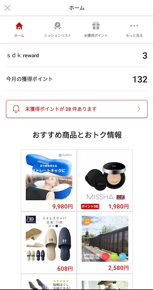
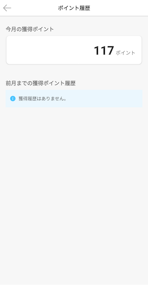

[TOP](/README.md#top)　>　[Basic Guide](./README.md)　>　SDK Built-in UI  

---  
 
 # SDK Built-in UI  
 Reward SDK provides several built-in UI. To use these UI you need to import `rewardsdknative-ui`.  

 ## SDK Portal  
 We provide User Portal UI for developers. To call Open SDK Portal API, developers can see user status (mission, unclaim list, current point, point history etc...)

```kotlin
RakutenReward.openSDKPortal()
```  

### Detect Portal closed event  
[](/doc/history/README.md#version-240)  
The open SDK portal API will return a boolean flag to indicate whether SDK portal is launched or not.

If you need to handle the SDK Portal close event, use the following API and provide a specific request code.
```kotlin
val success: Boolean = RakutenReward.openSDKPortal(101)
```
SDK Portal closed event can be detected at onActivityResult
```kotlin
override fun onActivityResult(requestCode: Int, resultCode: Int, data: Intent?) {
    super.onActivityResult(requestCode, resultCode, data)
    if (requestCode == 101) {
        // handle SDK Portal closed event here
    }
}
```  

[](https://github.com/rakuten-ads/Rakuten-Reward-Native-Android/releases/tag/rel_20221202_v3_4_2)  
Androidx Activity Result API is used to get Activity result, instead of using deprecated `startActivityForResult` and `onActivityResult`.

Use the following API and provide a `ActivityResultCallback<ActivityResult>`
```kotlin
val success: Boolean = RakutenReward.openSDKPortal {
    // handle SDK Portal closed event here
}
```  

### Detect is Portal launched  
[](https://github.com/rakuten-ads/Rakuten-Reward-Native-Android/releases/tag/rel_v6_0_0)  
The above API return a boolean value which indicate whether the portal is launched successfully. However the returned value now may not be correct. 

In order to get the correct event and the error which cause the portal failed to launch, please use the API below.  

```kotlin
RakutenReward.openSDKPortal({ result ->
   when (result) {
    is Failed -> // Failed to launch. Get the error here `result.error`
    is Success -> // Portal is launched successfully
   }
}) {
    // handle Portal closed event here
}
```  

<br>  
This is UI Image

  

  



<br>  

## Reward Button  
Reward SDK official button to access Reward SDK Portal.  
This button manage Reward SDK session status(Disable and gray out indicates session is OFFLINE or disable feature).  

To use the button, add it in the layout XML.  
```xml
<com.rakuten.gap.ads.mission_ui.ui.reward.RewardButton
    android:layout_width="60dp"
    android:layout_height="60dp"
    app:badge_position="top_right"
    app:button_style="dark"
    app:show_badge="true" 
    />
```  
### XML Attributes
* badge_position  
> Related Method: `setBadgePosition(BadgePosition)`  
* button_style  
> Related Method: `setButtonStyle(RewardButtonStyle)`  
* show_badge  
> Related Method: `setBadgeVisible(bool)`  

### Public Method Summary  
| Method                                         | Details                                    |
|------------------------------------------------|--------------------------------------------|
| setBadgePosition(position: BadgePosition)      | Set badge position                         |
| setBadgeVisible(visible: Boolean)              | Set unclaimed number badge visible setting |
| setButtonStyle(buttonStyle: RewardButtonStyle) | Set reward button style                    |
| setCustomImage (@DrawableRes resourceId: Int)  | Set custom button image                    |  

#### RewardButtonStyle  
| RewardButtonStyle |            Dark            |            Light             |
|:------------------|:--------------------------:|:----------------------------:|
| Sample            |  |  |  

#### BadgePosition  
| BadgePosition |             TOP_LEFT              |              TOP_RIGHT              |             CENTER             |               BOTTOM_LEFT               |               BOTTOM_RIGHT                |
|:--------------|:---------------------------------:|:-----------------------------------:|:------------------------------:|:---------------------------------------:|:-----------------------------------------:|
| Sample        |  |  |  |  |  |        

<br>  

---
LANGUAGE :
> [](../ja/basic/SdkPortal.md)