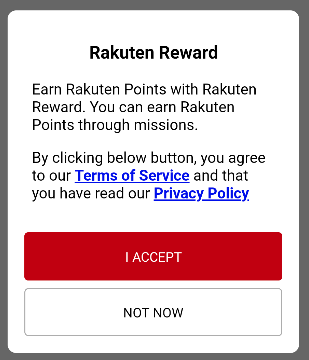

[TOP](../../README.md#top)　>　Request User Consent

Table of Contents
* [Overview](#request-user-consent-feature-overview)<br>
* [Changes to existing API](#changes-to-existing-api) <br>
    * [USER_NOT_CONSENT status](#user_not_consent-status) <br>
    * [New RakutenRewardListener function](#new-rakutenrewardlistener-function) <br>
* [Request User Consent API](#request-user-consent-api)
* [Show consent notification banner](#show-consent-notification-banner)  
* [Sample Use Case](#sample-use-case)
    * [When to request user consent](#when-to-request-user-consent)
    * [Log Mission Action](#log-mission-action)

---
# Request User Consent feature Overview
Since version 4.0.0, Reward SDK integrated request user consent feature. <br>
In order to use Reward SDK's features, users have to provide their consent for Reward term of use and privacy policy first. <br>
Below will go thru how to request for user consent and the changes to existing API. <br>

# Changes to existing API
## USER_NOT_CONSENT status
New Reward SDK status is introduced as mentioned [here](../APIReference/README.md#rakutenrewardsdkstatus). <br>
`USER_NOT_CONSENT` status will be returned in `RakutenRewardListener#onSDKStatusChanged` when the user have not provide consent yet. <br>

## New RakutenRewardListener function
New function is added to RakutenRewardListener as mentioned [here](../APIReference/README.md#rakutenrewardlistener). <br>
`RakutenRewardListener#onSDKConsentClosed()` will be triggered whenever a consent dialog is closed.

# Request User Consent API
New API is introduced to request for user consent. 

```kotlin
RakutenReward.requestForConsent { status ->
    // check consent status
}
```
If user have not provide consent yet, a consent dialog will be shown. 



Depends on user action, will the following consent status will be return in the callback.

| RakutenRewardConsentStatus | Description |
| --- | --- |
| CONSENT_PROVIDED | User already provide consent |
| CONSENT_NOT_PROVIDED | User have not provide consent |
| CONSENT_FAILED | There is some error with API request |
| CONSENT_PROVIDED_RESTART_SESSION_FAILED | User provided consent but failed to restart SDK session |

If user already provided consent, the consent dialog will not be shown and the callback will be triggered with `CONSENT_PROVIDED` status.  

# Show consent notification banner
New API is introduced to show notification banner when user haven't provide consent.  

```kotlin
RakutenReward.showConsentBanner {
    // check consent status
}
```

  

The banner above will only be shown when user haven't provide consent. When tap on the banner, consent dialog will be shown to request user's consent.   
If user already provided consent, the banner will not be shown and the callback will be triggered with `CONSENT_PROVIDED` status.  

# Sample Use Case
## When to request user consent
Reward SDK will not display consent dialog on behalf of client app unless `RakutenReward.requestForConsent()` API is called. <br>
So client app developers can decide which screen to display the consent dialog.

> `RakutenReward.openSDKPortal()` API will handle the case where user haven't provide consent. <br>
> After user provided the consent will proceed to open SDK portal page. <br>
> If user don't provide consent, SDK portal page will not be shown.

Sample code on when to request user consent
```kotlin
class SampleActivity : RakutenRewardBaseActivity() {

    override fun onSDKStatusChanged(status: RakutenRewardSDKStatus) {
        if (status == RakutenRewardSDKStatus.USER_NOT_CONSENT) {
            // when SDK status is USER_NOT_CONSENT, call the following API to show consent dialog to request user consent
            RakutenReward.requestForConsent()
        }
    }
}
```

## Log Mission Action
The code below will log a mission action. 

```kotlin
fun logMissionAction() {
    RakutenReward.logAction("action1", {}) {}
}
```

However if user haven't provide consent, this API will fail. <br>
This case can be handle with the code below.

```kotlin
fun logMissionAction() {
    RakutenReward.requestForConsent { status ->
        if (status == RakutenRewardConsentStatus.CONSENT_PROVIDED) {
            RakutenReward.logAction("action1", {}) {}
        }
    }
}
```

The code above will above will display the consent dialog if user haven't provide consent, and once user provided the consent will proceed to log mission action.

Even if user already provided consent, it is still safe to call `RakutenReward.requestForConsent()` API as consent dialog will not be shown and `CONSENT_PROVIDED` status will be return in the callback.

---
LANGUAGE :
> [](../ja/consent/README.md)