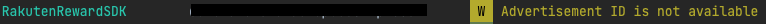
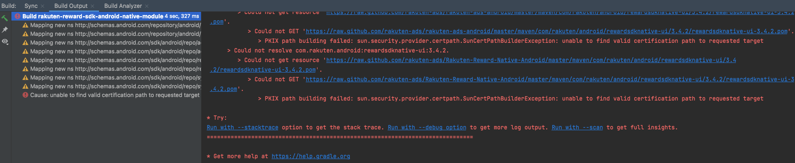
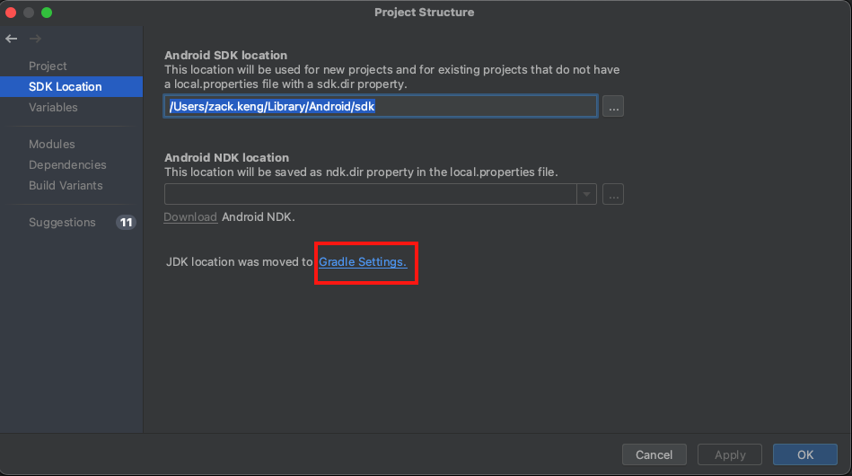
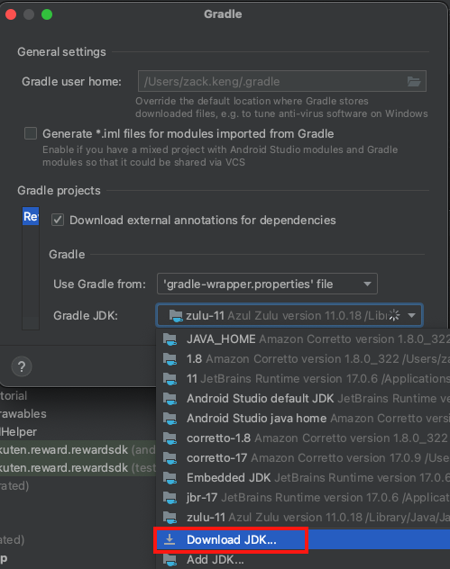
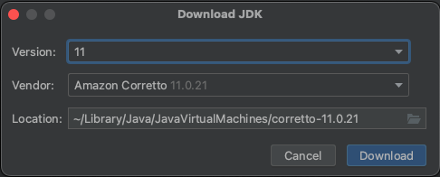
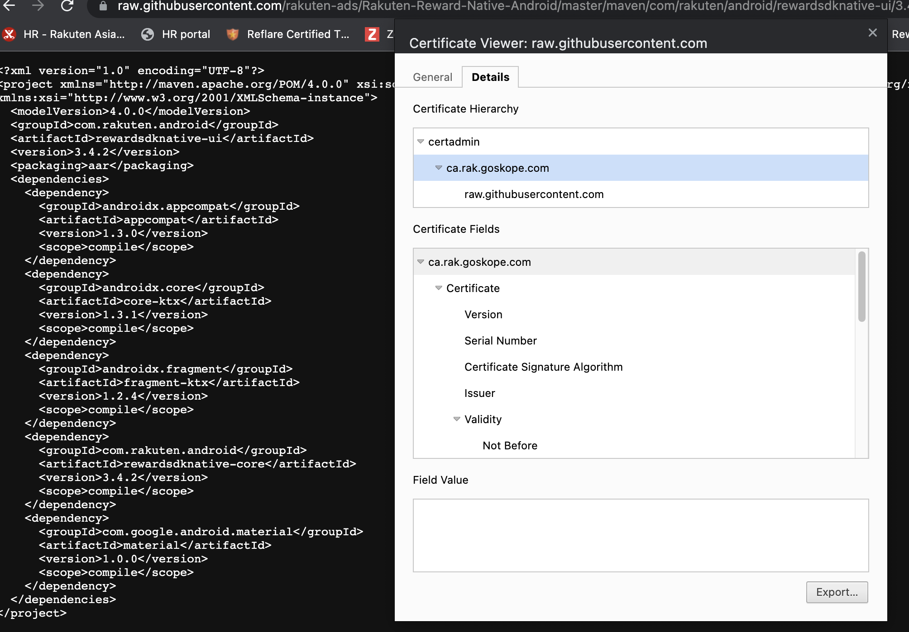
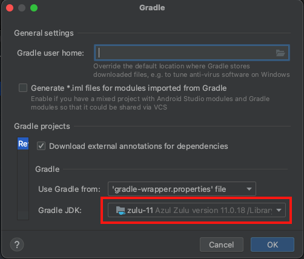

[TOP](../../README.md#top)　>　FAQ

Table of Contents
* [General](#general)
    * [Reward SDK is written in JAVA or Kotlin? My applcation is written in JAVA fully, is there any problem using the Reward SDK?](#reward-sdk-is-written-in-java-or-kotlin-my-applcation-is-written-in-java-fully-is-there-any-problem-using-the-reward-sdk)
    * [Can we access the staging environment for development / testing?](#can-we-access-the-staging-environment-for-development--testing)
    * [Does Reward SDK collect end user's Advertising ID (ADID)?](#does-reward-sdk-collect-end-users-advertising-id-adid)
    * [How to opt out collecting end user's Advertising ID (ADID)?](#how-to-opt-out-collecting-end-users-advertising-id-adid)  
    * [Build Error - unable to find valid certification path to requested target](#build-error---unable-to-find-valid-certification-path-to-requested-target)  
* [Login Related](#login-related)
    * [What is Rakuten Auth login for?](#what-is-rakuten-auth-login-for)
    * [I'm using RID / RAE login option, do I have to call RakutenAuth.logout API when user logged out?](#im-using-rid--rae-login-option-do-i-have-to-call-rakutenauthlogout-api-when-user-logged-out)
    * [Can RakutenAuth.openLoginPage API be call in Fragment class?](#can-rakutenauthopenloginpage-api-be-call-in-fragment-class)
* [Implementation Related](#implementation-related)
    * [The API always return SDKNOTACTIVE error. What could be the cause?](#the-api-always-return-sdknotactive-error-what-could-be-the-cause)
    * [I have a daily launch app mission. How should I implement it?](#i-have-a-daily-launch-app-mission-how-should-i-implement-it)
    * [How can I implement the custom notification UI?](#how-can-i-implement-the-custom-notification-ui)
    * [How do I claim mission after a mission is achieved?](#how-do-i-claim-mission-after-a-mission-is-achieved)
    * [How do I implement onSDKStatusChanged or onUnclaimedAchievement?](#how-do-i-implement-onsdkstatuschanged-or-onunclaimedachievement)
    * [Is it possible to detect SDK Portal closed event?](#is-it-possible-to-detect-sdk-portal-closed-event)
    * [After I set token using RakutenReward.setRaeToken / RakutenReward.setRIdToken but SDK status is still offline.](#after-i-set-token-using-rakutenrewardsetraetoken--rakutenrewardsetridtoken-but-sdk-status-is-still-offline)  
* [BOM](#bom)  
    * [Am I forced to use the BOM?](#am-i-forced-to-use-the-bom)  
    * [How do I use different library version than what's designated in the BOM?](#how-do-i-use-different-library-version-than-whats-designated-in-the-bom)  
    * [Does the BOM automatically add all the libraries to my app?](#does-the-bom-automatically-add-all-the-libraries-to-my-app)

---
# FAQ

## General 

### Reward SDK is written in JAVA or Kotlin? My applcation is written in JAVA fully, is there any problem using the Reward SDK?
<details>
    <summary>Answer</summary>
Reward SDK is written in Kotlin fully.

Reward SDK is supported for JAVA as well, but there might be some difference in calling the API.

Please refer [here](../java/README.md) for the full description.

</details>

<br>

### Can we access the staging environment for development / testing?
<details>
    <summary>Answer</summary>
No, currently we do not provide staging environment for developers. Please use development mode or test account for development / testing.

</details>

<br>

### Does Reward SDK collect end user's Advertising ID (ADID)?
<details>
    <summary>Answer</summary>
Yes, Reward SDK do collect user's Advertising ID (ADID).  

Reward SDK uses the ADID for Advertisement Optimization. 

</details>

<br>

### How to opt out collecting end user's Advertising ID (ADID)?
<details>
    <summary>Answer</summary>
Reward SDK uses Google Play library Ads Identifier to collect user ADID. In order to stop collecting user ADID add the following changes:

Add the following in app/build.gradle file to remove Ads Identifier library.
```groovy
implementation ('com.rakuten.android:rewardsdknative-ui:x.x.x') {
    exclude group: 'com.google.android.gms', module: 'play-services-ads-identifier'
} 
```

Add the following in AndroidManifest file to disable ADID permission.
```xml
<uses-permission 
    android:name="com.google.android.gms.permission.AD_ID"
    tools:node="remove" />
```

To verify Reward SDK does not collect user ADID anymore, check for the following log:



</details>

<br>

### Build Error - unable to find valid certification path to requested target  
I got build error on importing Reward SDK dependency. How to resolve this error?  
  

<details>
    <summary>Answer</summary>  

There are 2 approaches to fix this issue.  

<details>
    <summary>1. Update Gradle JDK</summary>

Update the Gradle JDK in Android Studio. 

First open Project Structure and click on Gradle Settings.  
  

For the JDK, do not use Android Studio default JDK. If there is other JDK please choose that JDK. Else download a new JDK.  
  
  

After download the new JDK, choose that JDK version to click OK.  

Gradle sync the project again.  

</details>

<details>
    <summary>2. Import CA Certificate</summary>

First download the CA certificate from raw.githubusercontent.com  
Open the link https://raw.githubusercontent.com/rakuten-ads/Rakuten-Reward-Native-Android/master/maven/com/rakuten/android/rewardsdknative-ui/3.4.2/rewardsdknative-ui-3.4.2.pom in Google Chrome.   
Then click on the lock icon to download the CA certificate.  
  

Next is to import the CA certificate to JAVA trust store.  
First check where is the Android Studio Gradle JDK location.  
  

Then run the following script where `JDK-location` is the jdk path above.   
```bash
cd <JDK-location>/Contents/Home
```  

Then import the cert to JAVA trust store where `cert-path` is the path of the downloaded CA certificate.    
```bash
./bin/keytool -importcert -keystore lib/security/cacerts -storepass changeit -file <cert-path> -alias "github_cert"
```  

After accepting the cert to the trust store, restart Android Studio and Gradle sync again.  

</details>  

If both the approach above doesn't help, please contact the developer team. 
</details>

## Login Related

### What is Rakuten Auth login for?
<details>
    <summary>Answer</summary>
The RakutenAuth login option is for third-party. For example, apps outside Rakuten which do not use Rakuten login SDK (RID or RAE). Therefore they can use the RakutenAuth login option.

If your app is using Rakuten login SDK already, then you don't need to use this login option.

</details>

<br>

### I'm using RID / RAE login option, do I have to call `RakutenAuth.logout` API when user logged out?
<details>
    <summary>Answer</summary>
If you are using Reward SDK version <strong>3.1.1</strong> and above, then yes you need to call the logout API regardless of which login options to properly clear the token and data.

```kotlin
RakutenAuth.logout(object : LogoutResultCallback {
    override fun logoutSuccess() {
        //logout completed
    }

    override fun logoutFailed(e: RakutenRewardAPIError) {
        //logout failed
    }
})
```

</details>

<br>

### Can `RakutenAuth.openLoginPage` API be call in `Fragment` class?
<details>
    <summary>Answer</summary>
Yes, you can call the API in a Fragment class by providing the Fragment instance and <code>onActivityResult</code> will be triggered in the Fragment class.

Sample implementation
```kotlin
class TestLoginFragment : Fragment() {
    companion object {
        private const val LOGIN_REQ_CODE = 533
    }
     
    private fun login() {
        // provide the Fragment instance instead of requireActivity()
        RakutenAuth.openLoginPage(this, LOGIN_REQ_CODE)
         
        // if the following is called, then onActivityResult will be triggered in the Activity class instead
        // RakutenAuth.openLoginPage(requireActivity(), LOGIN_REQ_CODE)
    }
 
    override fun onActivityResult(requestCode: Int, resultCode: Int, data: Intent?) {
        super.onActivityResult(requestCode, resultCode, data)
        if (requestCode == LOGIN_REQ_CODE) {
            if (resultCode == RESULT_OK) {
                RakutenAuth.handleActivityResult(data, object : LoginResultCallback {
                    override fun loginSuccess() {
                        // login success
                    }
 
                    override fun loginFailed(e: RakutenRewardAPIError) {
                        Toast.makeText(requireContext(), "Login Failed", Toast.LENGTH_SHORT).show()
                    }
                })
            } else {
                Toast.makeText(requireContext(), "Login Cancelled", Toast.LENGTH_SHORT).show()
            }
        }
    }
}
```

</details>

<br>

## Implementation Related

### The API always return `SDKNOTACTIVE` error. What could be the cause?
<details>
    <summary>Answer</summary>

This error means Reward SDK is not yet started and haven't sync up data. 

First check is the init API called in the Application class and check is the provided App Key correct.
``` kotlin
RakutenReward.init(<AppKey>)
```
>**\*From version 3.3.0 onward, manual initialization is no longer needed.**
>
>Set your `App Key` in your application's AndroidManifest.xml as follow:
>```xml
><application>
>    <!-- Reward SDK Application Key -->
>    <meta-data
>        android:name="com.rakuten.gap.ads.mission_core.appKey"
>        android:value="{Application Key}"/>
></application>
>```

Then check is the Activity class which call the API had use one of the options [here](../basic/README.md#initialize-sdk) to start the SDK. 

If both the above are setup correctly, wait for the SDK status changed to <code>ONLINE</code> before calling the API. Status changed will be triggered in the method below.
```kotlin
override fun onSDKStatusChanged(status: RakutenRewardSDKStatus) {
    if (status == RakutenRewardSDKStatus.ONLINE) {
        // SDK is active now, call the API here
    }
}
```
</details>

<br>

### I have a daily launch app mission. How should I implement it?
<details>
    <summary>Answer</summary>

To log the mission's action code everytime user launch the app, you should wait the SDK status changed to <code>ONLINE</code> first. This is due to Reward SDK require some time to sync up data. 

The status changed will be triggered in the method below.
```kotlin
override fun onSDKStatusChanged(status: RakutenRewardSDKStatus) {
    if (status == RakutenRewardSDKStatus.ONLINE) {
        RakutenReward.logAction(<ActionCode>, {
            // log action success
        }) {
            // log action failed
        }
    }
}
```
</details>

<br>

### How can I implement the custom notification UI?
<details>
    <summary>Answer</summary>
For example, Mission A need 3 actions logged to be achieved.

```kotlin
RakutenReward.logAction(<ActionCode>, {
    // log action success
}) {
    // log action failed
}
```
After the above <code>logAction</code> API is called 3 times successfully, Mission A is achieved and <code>onUnclaimedAchievement</code> method in <code>RakutenRewardListener</code> will be triggered. 

Sample implementation for showing custom UI
```kotlin
override fun onUnclaimedAchievement(achievement: MissionAchievementData) {
    if (achievement.custom // check is notification type CUSTOM
        && RakutenRewardConfig.isUiEnabled() // check if user enable the UI setting
    ) {
        // Show custom UI in MAIN thread
    }
}
```

</details>

<br>

### How do I claim mission after a mission is achieved?
<details>
    <summary>Answer</summary>
Claim API is available in the <code>MissionAchievementData</code> object. 

```kotlin
achievement.claim({
    // claim success
}) {
    // claim failed
}
```

There are 2 ways to get <code>MissionAchievementData</code> object. 

First is when user achieved a CUSTOM notification type mission, <code>onUnclaimedAchievement</code> will be triggered.

```kotlin
override fun onUnclaimedAchievement(achievement: MissionAchievementData) {
    if (achievement.custom // check is notification type CUSTOM
        && RakutenRewardConfig.isUiEnabled() // check if user enable the UI setting
    ) {
        // Show custom UI in MAIN thread and call the following to claim mission
        achievement.claim({
            // claim success
        }) {
            // claim failed
        }
    }
}
```

Second is by calling get unclaim items API.

```kotlin
RakutenReward.getUnclaimedItems({ unclaimList ->
    unclaimList[0].claim({
        // claim success
    }) {
        // claim failed
    }
}) {
    // get unclaim items failed
}
```

</details>

<br>

### How do I implement `onSDKStatusChanged` or `onUnclaimedAchievement`?
<details>
    <summary>Answer</summary>
onSDKStatusChanged, onUnclaimAchievement are methods in RakutenRewardListener. Create a new object of RakutenRewardListener and provide your implementation for each methods.

```kotlin
val listener = object : RakutenRewardListener {
    override fun onUnclaimedAchievement(achievement: MissionAchievementData) {
        // user achieved a mission. This is mainly used for CUSTOM notification type.
    }
 
    override fun onUserUpdated(user: RakutenRewardUser) {
        // user data is updated
    }
 
    override fun onSDKStatusChanged(status: RakutenRewardSDKStatus) {
        // Reward SDK status changed
    }
 
    override fun onSDKClaimClosed(
        missionAchievementData: MissionAchievementData,
        status: RakutenRewardClaimStatus
    ) {
        // claim view is closed
    }
}
```
Then call the following APIs to add or remove the listener object. Remove listener API is required to prevent memory leak.

```kotlin
override fun onResume() {
    RakutenReward.addRakutenRewardListener(listener)
    super.onResume()
}
 
override fun onPause() {
    super.onPause()
    RakutenReward.removeRakutenRewardListener(listener)
}
```
> :grey_exclamation:  **If you are using `RakutenRewardBaseActivity` to start the SDK, the above are not needed as `RakutenRewardBaseActivity` class already handled it. You can simply override the method which you needed and provide you own implementation**

</details>

<br>

### Is it possible to detect SDK Portal closed event?
<details>
    <summary>Answer</summary>
Yes, it is possible to detect SDK portal closed event. Provide a unique request code to <code>openSDKPortal</code> API and <code>onActivityResult</code> will be triggered when SDK portal is closed.

Sample implementation

```kotlin
class SampleActivity : RakutenRewardBaseActivity() {
    companion object {
        private const val UNIQUE_REQ_CODE = 478
    }
 
    override fun onCreate(savedInstanceState: Bundle?) {
        super.onCreate(savedInstanceState)
        RakutenReward.openSDKPortal(UNIQUE_REQ_CODE)
    }
 
    override fun onActivityResult(requestCode: Int, resultCode: Int, data: Intent?) {
        if (requestCode == UNIQUE_REQ_CODE) {
            // handle SDK portal closed event
        } else {
            super.onActivityResult(requestCode, resultCode, data)
        }
    }
}
```
> :grey_exclamation:  **`RakutenReward.openSDKPortal()` API can be call in `Fragment` class as well, however `onActivityResult` will be triggered in Fragment class's parent activity instead**

</details>

<br>

### After I set token using `RakutenReward.setRaeToken` / `RakutenReward.setRIdToken` but SDK status is still offline.
<details>
    <summary>Answer</summary>
After setting the token, need to manually trigger to start SDK session by calling the following API. <br>
<code>RakutenReward.startSession()</code><br><br>

Sample implementation


```kotlin
class SampleActivity : RakutenRewardBaseActivity() {
    ....

    private fun setToken() {
        RakutenReward.setRaeToken("token")
        // this API is available since v3.4.2
        RakutenReward.startSession()
    }
}
```
</details>  
<br>

## BOM  

### Am I forced to use the BOM?  
<details>
    <summary>Answer</summary>  
No. You can still choose to add each dependency version manually. However, we recommend using the BOM as it will make it easier to use all of the latest stable versions at the same time.  
</details>  

<br>  

### How do I use different library version than what's designated in the BOM?  
<details>
    <summary>Answer</summary>  
You can specify your desire library version to override the version designated in the BOM.   
</details>   

<br>  

### Does the BOM automatically add all the libraries to my app?  
<details>
    <summary>Answer</summary>  
No. To actually add and use Reward Native libraries in your app, you must declare each library as a separate dependency line your gradle file.  

Using the BOM ensures that the versions of any Reward Native libraries in your app are compatible, but the BOM doesn't actually add those libraries to your app.  
</details>   
