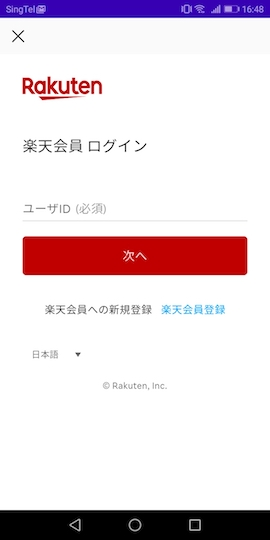

[トップ](../README.md#top)　>　[基本ガイド](./README.md)　>　ログイン  

---

# ログイン
楽天ログインSDKを使うの場合、これは必要ないです。 

## Activity クラス
### 1. ログインページを表示する

```kotlin
RakutenAuth.openLoginPage(context, REQUEST_THIRD_PARTY_LOGIN)
```


### 2. ログイン終了の結果を受け取る `onActivityResult()`
```kotlin
override fun onActivityResult(requestCode: Int, resultCode: Int, data: Intent?) {
    if (requestCode == REQUEST_THIRD_PARTY_LOGIN) {
        if (resultCode == RESULT_OK) {
            handleActivityResult(data)
        } else {
            //ユーザーがログインをキャンセルした
        }
    }
}
```

### 3. ログインの最終的なプロセスを受け取る `RakutenAuth.handleActivityResult()`
```kotlin
private fun handleActivityResult(data: Intent?) {
    RakutenAuth.handleActivityResult(data, object : LoginResultCallback {
        override fun loginSuccess() {
            //✅ ログイン成功
        }

        override fun loginFailed(e: RakutenRewardAPIError) {
            //⛔ ログイン失敗
        }
    })
}
```
<details>
    <summary>JAVA</summary>

```java
RakutenAuth.handleActivityResult(null, new LoginResultCallback() {
    @Override
    public void loginSuccess() {
        //✅ ログイン成功
    }

    @Override
    public void loginFailed(@NonNull RakutenRewardAPIError rakutenRewardAPIError) {
        //⛔ ログイン失敗
    }
});
```    
</details>  

ログインの画面終了後、APIへのアクセスに必要なデータ処理を行います。楽天へのログインは2で終了しておりますが、　　  
データ処理をを受け取るにはこちらのようなコールバックを待っていただく必要があります。

## Fragment クラス
[](/doc/history/README.md#version-241)

Fragmentクラスで `RakutenAuth.openLoginPage()` APIを使える。Activityの参照の代りにFragmentの参照を提供してください。  
Fragmentクラス内の `onActivityResult()` でログイン終了の結果を受け取る。  

## AndroidX Activity Result API
[](https://github.com/rakuten-ads/Rakuten-Reward-Native-Android/releases/tag/rel_20221202_v3_4_2)

`startActivityForResult` と `onActivityResult` は Android 11 (API 30)から廃止予定になりました。それでAndroidx Activity Result APIを使っている新しいAPIを提供する。  
Activity Result APIを使用する場合、以下のライブラリを追加してください。
```groovy
androidx.activity:activity:1.2.0 //1.2.0 or later
//or
androidx.activity:activity-ktx:1.2.0 //1.2.0 or later
```

以下のAPIを使って、`ActivityResultCallback<ActivityResult>`を提供してください。
```kotlin
RakutenAuth.openLoginPage(context) { result ->
    if (result.resultCode == RESULT_OK) {
        RakutenAuth.handleActivityResult(result.data, object : LoginResultCallback {
            override fun loginSuccess() {
                //✅ ログイン成功
            }

            override fun loginFailed(e: RakutenRewardAPIError) {
                //⛔ login failed
            }
        })
    }
}
```  
<details>
    <summary>JAVA</summary>

```java
RakutenAuth.openLoginPage(this, result -> {
    if (result.resultCode == RESULT_OK) {
        RakutenAuth.handleActivityResult(null, new LoginResultCallback() {
            @Override
            public void loginSuccess() {
                //✅ ログイン成功
            }

            @Override
            public void loginFailed(@NonNull RakutenRewardAPIError rakutenRewardAPIError) {
                //⛔ ログイン失敗
            }
        });
    }
});
```    
</details>  
  
<br>

---
言語 :
> [](../../basic/LOGIN.md)