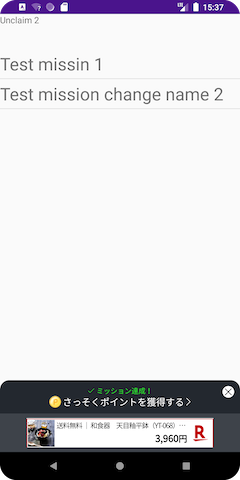

[トップ](../README.md#top)　>　[基本ガイド](./README.md)　>　ミッションの達成    

---  
  
# ミッションの達成  
ミッションを達成するには、開発者はアクションAPIをコールします。    
ミッション達成後、ミッション達成UIが表示されます。   

## アクションを送信する  
### Kotlin
```kotlin
RakutenReward.logAction("<actionCode>", {
    // 送信成功
}, {
    // 送信失敗
})
```  
### JAVA
```java
RakutenReward.logActionJava("<actionCode>", new LogActionCallback() {
    @Override
    public void success() {

    }

    @Override
    public void fail(@NonNull RakutenRewardAPIError rakutenRewardAPIError) {

    }
});
```  
### Coroutine  
[](https://github.com/rakuten-ads/Rakuten-Reward-Native-Android/releases/tag/rel_20220826_v3_3_0)  
```kotlin
val result = RakutenRewardCoroutine.logAction("<actionCode>")
```  
`actionCode` は開発者ポータルより取得します。  

<br>  

## ミッション達成UI   
ユーザーがミッションを達成すると、下記のようなミッション達成UIが表示されます    
楽天リワードではモーダルとバナーと広告バナーを用意しております  

     

     

### ミッション達成UIの種類
楽天リワードSDKは6つの種類のミッション達成の種類があります - モーダル、バナー、広告バナー（小）、 広告バナー（大）、UIなし、カスタム  
これらの設定は開発者ポータルから設定できます  

| ミッション達成UIの種類 | 説明               |
|--------------|------------------|
| モーダル         | モーダルUIを表示する      |
| バナー          | バナーUIを表示する       |
| 広告バナー（小）     | 広告バナーUIを表示する     |
| 広告バナー（大）     | 広告バナーUIを表示する     |
| カスタム         | 開発者が自由にUIを作成できます |
| UIなし         | UIを表示しません        |  

### ミッション達成UIをオフする  
リワードSDKはミッション達成UIをオフする設定を提供します。   
```kotlin
RakutenRewardConfig.setUiEnabled(false)
```  

<br>

## ポイントを獲得する
ミッション達成UIが表示したあと、ユーザがUIにタップしてポイントを獲得する。    
ポイントを獲得UIが表示されます。   

  

### ミッション達成後のカスタムUIの作り方  
SDKのイベントリスナー `RakutenRewardListener` を使ってミッションの達成イベントを受け取ります  

```kotlin
override fun onUnclaimedAchievement(achievement: MissionAchievementData) {
    if (achievement.custom // check is notification type CUSTOM
        && RakutenRewardConfig.isUiEnabled() // check if user enable the UI setting
    ) {
        // 達成通知を表示する
    }
}
```

ポイントを獲得するには、`MissionAchievementData` クラスの `claim()` API を使います。    
```kotlin
achievement.claim({
    // 獲得成功
}, {
    // 獲得失敗
})
```  
<details>
    <summary>JAVA</summary>  

```java
achievement.claimJava(new CustomClaimCallback() {
    @Override
    public void success(@NonNull MissionAchievementData missionAchievementData) {
        
    }

    @Override
    public void fail(@NonNull RakutenRewardAPIError rakutenRewardAPIError) {

    }
});
```
</details>  

<br>

---
言語 :
> [](../../basic/MissionAchivement.md)