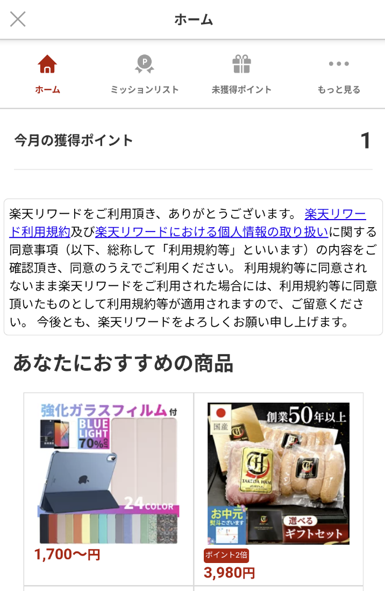
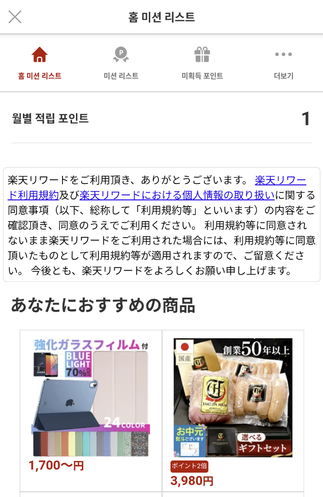
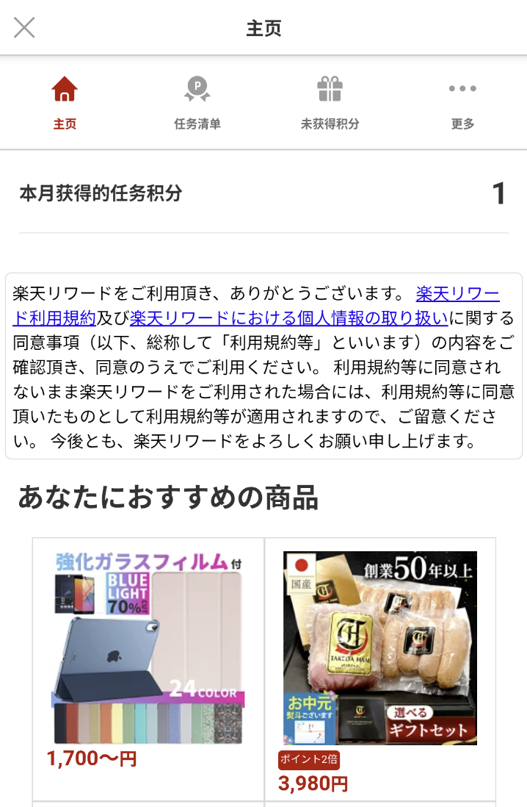
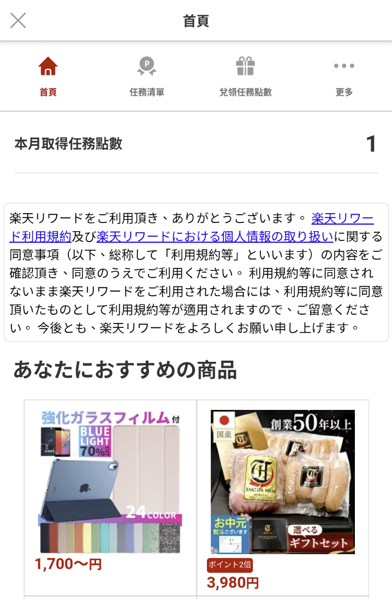

[トップ](../README.md#top)　>基本ガイド

コンテンツ
* [認証](#認証)<br>
  * [ログインオプション](#ログインオプション)<br>
  * [ログイン](#ログイン)<br>
  * [ログアウト](#ログアウト)<br>
* [SDKの初期化](#sdkの初期化)<br>
* [SDKステータス](#sdkステータス)<br>
* [ユーザー情報を取得する](#ユーザー情報を取得する)<br>
* [ミッションの達成](#ミッションの達成)<br>
* [SDK用意するUI](#sdk用意するui)<br>
* [SDKデバッグログ](#SDKデバッグログ)<br>
* [コルーチン サポート](#コルーチン-サポート)<br>
* [アプリのロケールを設定する](#アプリのロケールを設定する)<br><br>

---

# 認証

## ログインオプション
リワードSDK では3種類のログイン方法を提供しております。  
ご利用の環境に合わせて、適切なものをご利用ください。  
初期設定では、RAKUTEN_AUTH　になっております。  

***注意: RAEは2025年までに廃止されます。***

| ログインオプション    | 説明                                                 |
|--------------|----------------------------------------------------|
| RAKUTEN_AUTH | 初期設定、ログインやユーザーの処理を全てリワードSDKが担当します                  |
| RID          | ログイン部分はID SDKが担当します(RID)。トークンをリワードSDKに渡す必要があります    |  
| RAE          | ログイン部分はUser SDKが担当します(RAE)。 トークンをリワードSDKに渡す必要があります |  
<br>

## ログインオプションを切り替える

初期設定では、リワードSDKが用意したログインになります。(RAKUTEN_AUTH)  
<br>

### RAKUTEN_AUTH
```kotlin
RakutenReward.tokenType = RakutenRewardTokentype.RAKUTEN_AUTH
```
<details>
    <summary>JAVA</summary>

```java
RakutenReward.INSTANCE.setTokenType(RakutenRewardTokentype.RAKUTEN_AUTH);
```    
</details>
<br>   

### RID
```kotlin
RakutenReward.tokenType = RakutenRewardTokentype.RID
```
<details>
    <summary>JAVA</summary>

```java
RakutenReward.INSTANCE.setTokenType(RakutenRewardTokentype.RID);
```    
</details>  

SDK APIを利用するには、開発者がAPI（API-C）トークンを設定する必要があります。
```kotlin
val tokenProvider = object: RewardTokenProvider {
    override suspend fun getAccessToken(): String {
        // 認証システムからトークンを返却
        return if (isUserLoggedIn()) {
            yourAuthManager.getAccessToken()
        } else {
            ""  // ユーザーがログインしていない場合は空文字列を返却
        }
    }
}
RakutenReward.init("<AppCode>", tokenProvider)
```

ログインの実装方法についてはID SDKのログインドキュメントをご参照ください。

> :grey_exclamation:  **ユーザーがログアウトする際は、必ず`logout` APIを呼び出してトークンやデータを正しくクリアしてください。**

[ログアウト](#ログアウト) を参照  
<br>

### RAE  
***このAPIは廃止予定になります***
```kotlin
RakutenReward.tokenType = RakutenRewardTokentype.RAE
```
<details>
    <summary>JAVA</summary>

```java
RakutenReward.INSTANCE.setTokenType(RakutenRewardTokentype.RAE);
```    
</details>  


SDK APIを利用するには、開発者がAPIトークンを設定する必要があります。
```kotlin
val tokenProvider = object: RewardTokenProvider {
    override suspend fun getAccessToken(): String {
        // 認証システムからトークンを返却
        return if (isUserLoggedIn()) {
            yourAuthManager.getAccessToken()
        } else {
            ""  // ユーザーがログインしていない場合は空文字列を返却
        }
    }
}
RakutenReward.init("<AppCode>", tokenProvider)
```

ログインの実装方法についてはUser SDKのログインドキュメントをご参照ください。

> :grey_exclamation:  **ユーザーがログアウトする際は、必ず`logout` APIを呼び出してトークンやデータを正しくクリアしてください。**

[ログアウト](#ログアウト) を参照  
<br>  

# ログイン  
[ここ](./LOGIN.md)に参考してください。  
楽天ログインSDKを使うの場合、これは必要ないです。 

<br>  


# ログアウト
ユーザーをログアウトする。  
> ユーザーがログアウト時にトークンやデータをちゃんと消すためにログアウトAPIを呼ぶ必要があります。  

```kotlin
private fun logout() {
    RakutenAuth.logout(object : LogoutResultCallback {
        override fun logoutSuccess() {
            //ログアウト 完了
        }

        override fun logoutFailed(e: RakutenRewardAPIError) {
            //ログアウト失敗
        }
    })
}
```
<details>
    <summary>JAVA</summary>

```java
RakutenAuth.logout(new LogoutResultCallback() {
    @Override
    public void logoutSuccess() {
        //ログアウト完了
    }

    @Override
    public void logoutFailed(@NonNull RakutenRewardAPIError rakutenRewardAPIError) {
        //ログアウト失敗
    }
});
```    
</details>  

<br><br>


# SDKの初期化
楽天リワードSDKを利用するにははじめに初期化が必要です(SDKユーザーの基本データを取得します)
SDKの機能を利用するのにはRakutenRewardクラスのメソッドを利用します

```kotlin
class App: Application() {

    override fun onCreate() {
        super.onCreate()
        // App CodeでSDKを初期化
        RakutenReward.init("<AppCode>")
    }
}
```

| パラメータ名  | 説明 |
|---------|-----------------------------------------|
| AppCode | アプリケーションキー (こちらは楽天リワードの開発者ポータルから取得できます) |

RAEやRIDオプションを利用する場合は、SDKを有効化するためにトークンを設定する必要があります。
<br/><br/>

### **\*バージョン 3.3.0 以降、手動初期化は不要です。**
アプリケーションのAndroidManifest.xmlに`App Code`を設定してください。
```xml
<application>
    <!-- Reward SDK Application Key -->
    <meta-data
        android:name="com.rakuten.gap.ads.mission_core.appKey"
        android:value="{Application Key}"/>
</application>
```
<br>

## 楽天のIDSDKを利用する場合  
楽天のIDSDKを使用し、ログインオプションに 、RID, RAE を選択した場合
アプリケーションキーの他にトークンを渡す必要があります。

<br><br/>

## Activity と紐づけてSDK機能をアクティブにする:

### 1 RakutenRewardLightBaseActivity を拡張した Activity クラスを作る
```kotlin
class YourActivity : RakutenRewardBaseActivity {}
```

### 2 Android のライフサイクル上でメソッドをコールする
```kotlin
class YourActivity : Activity() {

    override fun onCreate(savedInstanceState: Bundle?) {
        super.onCreate(savedInstanceState)
        RakutenRewardLifecycle.onCreate(this)
    }

    override fun onStart() {
        super.onStart()
        RakutenRewardLifecycle.onStart(this)
    }

    override fun onResume() {
        RakutenRewardLifecycle.onResume(this)
    }

    override fun onDestroy() {
        super.onDestroy()
        RakutenRewardLifecycle.onDestroy()
    }
}
```


### 3 AndroidX ライフサイクルイベントをバインドする
```kotlin
class YourActivity : AppCompatActivity() {

    override fun onCreate(savedInstanceState: Bundle?) {
        super.onCreate(savedInstanceState)
        RakutenRewardManager.bindRakutenRewardIn(this, this)
    }

}
```

この方法で行うためには Activity に LifecycleOwner を実装する必要があります

---  
<br>  


# ユーザー情報を取得する  
[ここ](./UserInfo.md)に参考してください。  
> こちらのAPIは `RAKUTEN_AUTH` のみ使える    
---  
<br>

# ミッションの達成
ミッションを達成するには、[ここ](./MissionAchivement.md)に参考してください。   

---  
<br>

# SDK用意するUI  
[ここ](./SdkPortal.md)に参考してください。

---  
<br>


# SDKデバッグログ

バージョン3.1.1以降、SDKデバッグログをできようになります。ApplicationクラスでこのAPIを使ってください。
```kotlin
override fun onCreate() {
    if (BuildConfig.DEBUG) {
        RakutenRewardConfig.isDebuggable()
    }
}
```  
<details>
    <summary>JAVA</summary>

```java
@Override
public void onCreate() {
    if (BuildConfig.DEBUG) {
        RakutenRewardConfig.isDebuggable();
    }
}
```    
</details>  

**DEBUGモードだけにこのAPIを使ってください。**

このAPIを使って、SDKロゴを見られます。タグは `RakutenRewardSDK`。

<br>

# コルーチン サポート

[](https://github.com/rakuten-ads/Rakuten-Reward-Native-Android/releases/tag/rel_20220826_v3_3_0)  
SDK は suspend 関数の API を提供しています。
suspend 関数の API は `RakutenRewardCoroutine`クラスにあります。[ここ](../APIReference/README.md#rakutenrewardcoroutine)に参照してください。

suspend 関数の API を使う場合、コルーチンのスコープで呼んでください。例えば、 `viewModelScope` もしくわ `lifecycleScope`。
```kotlin
lifecycleScope.launch { 
    val result = RakutenRewardCoroutine.getMissions()
    when (result) {
        is Failed -> {
            // 失敗ケース
            result.error // エラーコード
        }
        is Success -> {
            // 成功ケース
            val missionList = result.data
        }
    }
}
```
<br>

# アプリのロケールを設定する
[](https://github.com/rakuten-ads/Rakuten-Reward-Native-Android/releases/tag/rel_20250904_v7_5_0)  

Rakuten Reward SDKは5つの言語に対応しています：日本語、英語、韓国語、簡体字中国語、繁体字中国語
| 日本語 | 英語 | 韓国語 | 簡体字中国語 | 繁体字中国語 |
| --- | --- | --- | --- | --- |
|  |  |   |   |   |  

SDKポータルは、デバイスのロケールに従って言語を表示します。   
ただし、クライアントアプリが日本語のみ対応している場合、エンドユーザーのデバイスロケールが英語だと、クライアントアプリの画面は日本語で表示されるのに、SDKポータル画面は英語で表示されるため、ユーザー体験が一貫しない可能性があります。  

より良いユーザー体験のために、アプリのロケールを指定できるAPIを提供しています。これにより、SDKの画面も指定したロケールの言語で表示されます。 
[対応ロケール一覧](../apiData/README.md#supportedlocale)

```kotlin
RakutenRewardConfig.setAppLocale(Japanese)
```  

もしクライアントアプリがSDKで対応していない他の言語に対応している場合は、ISO 639言語コードを指定して`OtherLocale`としてアプリのロケールを設定できます。 
```kotlin
RakutenRewardConfig.setAppLocale(OtherLocale("ta")) // タイ語
```  
SDKがそのロケールに対応していない場合は、日本語で表示されます。 

---
言語 :
> [](../../basic/README.md)
