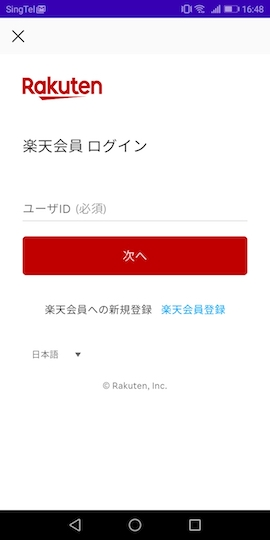
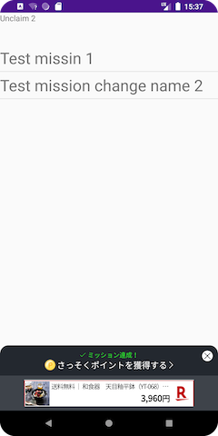
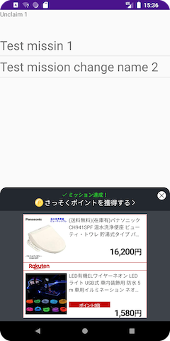
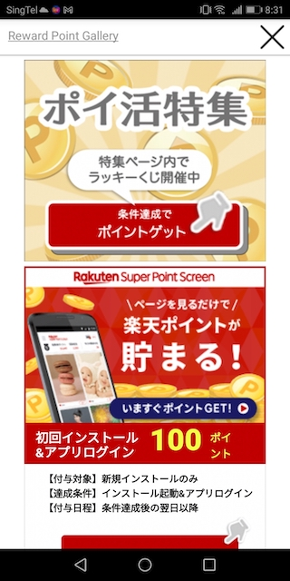
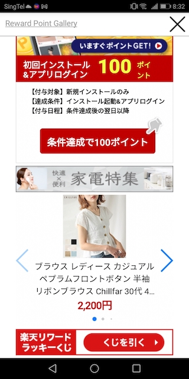

[トップ](../README.md#top)　>基本ガイド

コンテンツ
* [認証](#認証)<br>
  * [ログインオプション](#ログインオプション)<br>
  * [ログイン](#ログイン)<br>
  * [ログアウト](#ログアウト)<br>
* [SDKの初期化](#sdkの初期化)<br>
* [ユーザー情報を取得する](#ユーザー情報を取得する)<br>
* [ミッションの達成](#ミッションの達成)<br>
* [楽天リワードSDKポータル](#楽天リワードSDKポータル)<br>
* [広告ポータル](#広告ポータルバージョン-2.4.0-から)<br>
* [SDKデバッグログ](#SDKデバッグログ)<br>
* [コルーチン サポート](#コルーチン-サポート)<br><br>

---

# 認証

## ログインオプション
リワードSDK では3種類のログイン方法を提供しております。  
ご利用の環境に合わせて、適切なものをご利用ください。  
初期設定では、RAKUTEN_AUTH　になっております。

| ログインオプション        | 説明 | サポートしているリージョン |
| --- | --- | ---
| RAKUTEN_AUTH |  初期設定、ログインやユーザーの処理を全てリワードSDKが担当します | Japan, Taiwan |
| RID | ログイン部分はID SDKが担当します（RID)。トークンをリワードSDKに渡す必要があります | Japan |  
| RAE | ログイン部分はID SDKが担当します(RAE)。 トークンをリワードSDKに渡す必要があります | Japan |

### ログインオプションを切り替える

初期設定では、リワードSDKが用意したログインになります。(RAKUTEN_AUTH)

### RAKUTEN_AUTH
```kotlin
RakutenReward.tokenType = RakutenRewardTokentype.RAKUTEN_AUTH
```

### RID
```kotlin
RakutenReward.tokenType = RakutenRewardTokentype.RID
```
リワードSDKのAPIを利用するには、トークンの設定が必要です  
```kotlin
RakutenReward.setRIdToken("token")
```

ログインの実装方法についてはID　SDK の詳細をご参照ください。

> :grey_exclamation:  **バージョン3.1.１から、ユーザーがログアウト時にトークンやデータをちゃんと消すためにログアウトAPIを呼ぶ必要があります。**

[ログアウト](#ログアウト) に参照

### RAE
```kotlin
RakutenReward.tokenType = RakutenRewardTokentype.RAE
```

リワードSDKのAPIを利用するには、トークンの設定が必要です  
```kotlin
RakutenReward.setRaeToken("token")
```

ログインの実装方法についてはID　SDK の詳細をご参照ください。

> :grey_exclamation:  **バージョン3.1.１から、ユーザーがログアウト時にトークンやデータをちゃんと消すためにログアウトAPIを呼ぶ必要があります。**

[ログアウト](#ログアウト) に参照

# ログイン

### 1. ログインページを表示する　`RakutenAuth.openLoginPage()`
```kotlin
RakutenAuth.openLoginPage(context, REQUEST_THIRD_PARTY_LOGIN)
```




### 2.  ログイン終了の結果を受け取る `onActivityResult()`
```kotlin
override fun onActivityResult(requestCode: Int, resultCode: Int, data: Intent?) {
    if (requestCode == REQUEST_THIRD_PARTY_LOGIN) {
        if (resultCode == RESULT_OK) {
            handleActivityResult(data)
        } else {
            // ユーザーがログインをキャンセルした
        }
    }
}
```

### 3. ログインの最終的なプロセスを受け取る `RakutenAuth.handleActivityResult()`
```kotlin
private fun handleActivityResult(data: Intent?) {
    RakutenAuth.handleActivityResult(data, object : LoginResultCallback {
        override fun loginSuccess() {
            //✅ ログイン成功
        }

        override fun loginFailed(e: RakutenRewardAPIError) {
            //⛔ ログイン失敗
        }
    })
}
```

ログインの画面終了後、APIへのアクセスに必要なデータ処理を行います。楽天へのログインは2で終了しておりますが、　　  
データ処理をを受け取るにはこちらのようなコールバックを待っていただく必要があります。

### **FragmentクラスでAPIを使える**
バージョン２.４.１からFragmentクラスで `RakutenAuth.openLoginPage()` APIを使えるようになりました。Activityの参照の代りにFragmentの参照を提供してください。
Fragmentクラス内の `onActivityResult()` でログイン終了の結果を受け取る。


### **バージョン 3.4.2 から**
Androidx Activity Result APIを使っている新しいAPIを提供する。

以下のAPIを使って、`ActivityResultCallback<ActivityResult>`を提供してください。
```kotlin
RakutenAuth.openLoginPage(context) { result ->
    if (result.resultCode == RESULT_OK) {
        RakutenAuth.handleActivityResult(result.data, object : LoginResultCallback {
            override fun loginSuccess() {
                //✅ ログイン成功
            }

            override fun loginFailed(e: RakutenRewardAPIError) {
                //⛔ ログイン失敗
            }
        })
    }
}
```
<br><br>

# ログアウト
`RakutenAuth.logout()`
```kotlin
private fun logout() {
    RakutenAuth.logout(object : LogoutResultCallback {
        override fun logoutSuccess() {
            //ログアウト 完了
        }

        override fun logoutFailed(e: RakutenRewardAPIError) {
            //ログアウト失敗
        }
    })
}
```


# SDKの初期化
楽天リワードSDKを利用するにははじめに初期化が必要です(SDKユーザーの基本データを取得します)
SDKの機能を利用するのにはRakutenRewardクラスのメソッドを利用します

```kotlin
class App: Application() {

    override fun onCreate() {
        super.onCreate()
        //init sdk with your App Code
        RakutenReward.init(this, "<AppCode>")
    }
}
```

| パラメータ名        | 説明           
| --- | --- 
| AppCode |  アプリケーションキー (こちらは楽天リワードの開発者ポータルから取得できます)
<br/><br/>

### **\*バージョン 3.3.0 から、手動初期化は必要ないようになりました。**
アプリケーションのAndroidManifest.xmlに`App Code`を設定してくだたさい。
```xml
<application>
    <!-- Reward SDK Application Key -->
    <meta-data
        android:name="com.rakuten.gap.ads.mission_core.appKey"
        android:value="{Application Key}"/>
</application>
```
  
<br><br/>

### 楽天のIDSDKを利用する場合  
 楽天のIDSDKを使用し、ログインオプションに 、RID, RAE を選択した場合
 アプリケーションキーの他にトークンを渡す必要があります。

<br><br/>

### Activity と紐づけてSDK機能をアクティブにする:

### 1 RakutenRewardLightBaseActivity を拡張した Activity クラスを作る
```kotlin
class YourActivity : RakutenRewardBaseActivity {}
```

### 2 Android のライフサイクル上でメソッドをコールする
```kotlin
class YourActivity : Activity() {

    override fun onCreate(savedInstanceState: Bundle?) {
        super.onCreate(savedInstanceState)
        RakutenRewardLifecycle.onCreate(this)
    }

    override fun onStart() {
        super.onStart()
        RakutenRewardLifecycle.onStart(this)
    }

    override fun onResume() {
        RakutenRewardLifecycle.onResume(this)
    }

    override fun onDestroy() {
        super.onDestroy()
        RakutenRewardLifecycle.onDestroy()
    }
}
```


### 3 AndroidX ライフサイクルイベントをバインドする
```kotlin
class YourActivity : AppCompatActivity() {

    override fun onCreate(savedInstanceState: Bundle?) {
        super.onCreate(savedInstanceState)
        RakutenRewardManager.bindRakutenRewardIn(this, this)
    }

}
```

この方法で行うためには Activity に LifecycleOwner を実装する必要があります

---
# ユーザー情報を取得する

こちらは楽天会員情報を取得するAPIになっております

## ユーザーがログインしているかどうか
```kotlin
RakutenAuth.hasUserSignedIn(): Boolean
```

## ユーザーの名前を取得する　
```kotlin
RakutenAuth.getUserName(context: Context): String
```

##  ユーザーの会員ランク楽天ポイントを取得する
```kotlin
RakutenAuth.getUserInfo(
    success = { userInfo ->
        // ポイント　
        userInfo.points
        
        // ランク
        userInfo.rank
    }, 
    failed = {
        // 取得に失敗
    }
)
```

---
# ミッションの達成
ミッションを達成するには、開発者はアクションAPIをコールします  
ミッション達成後、ミッション達成UIが表示されます

## アクションを送信する
```kotlin
RakutenReward.logAction("<actionCode>", {}, {})
```
actionCode は開発者ポータルより取得します

## ミッション達成UI
ユーザーがミッションを達成すると、下記のようなミッション達成UIが表示されます  
楽天リワードではモーダルとバナーを用意しております

     

     

### ミッション達成UIの種類
楽天リワードSDKは4つの種類のミッション達成の種類があります  
モーダル、バナー、広告バナー（小）、 広告バナー（大）、UIなし、カスタム  
これらの設定は開発者ポータルから設定できます

| ミッション達成UIの種類        | 説明
| --- | ---
| モーダル | モーダルUIを表示する
| バナー | バナーUIを表示する
| 広告バナー（小）| 広告バナーUIを表示する
| 広告バナー（大） | 広告バナーUIを表示する
| カスタム | 開発者が自由にUIを作成できます
| UIなし | UIを表示しません

## 楽天リワードSDKポータル
ユーザーにリワードサービスの情報(ミッションや進捗、ポイントなど)を伝えるために  
楽天リワードSDKではポータルというのを提供しております  
このポータルを表示するにはポータル表示のAPIを呼ぶ必要があります

```kotlin
RakutenReward.openSDKPortal()
```

### **バージョン 2.4.0 から**
このポータル表示のAPIがポータルを表示したかどうかの結果を返します

ポータルを閉じたイベントを知る必要がある場合、このAPIを呼んで、特定のリクエストコードを提供してください。
 ```kotlin
 val success: Boolean = RakutenReward.openSDKPortal(101)
 ```
ポータルを閉じたイベントが onActivityResult で取得できます
 ```kotlin
 override fun onActivityResult(requestCode: Int, resultCode: Int, data: Intent?) {
    super.onActivityResult(requestCode, resultCode, data)
    if (requestCode == 101) {
        // handle SDK Portal closed event here
    }
}
 ```

 ### **バージョン 3.4.2 から**
Androidx Activity Result APIを使っている新しいAPIを提供する。

以下のAPIを使って、`ActivityResultCallback<ActivityResult>`を提供してください。
```kotlin
val success: Boolean = RakutenReward.openSDKPortal {
    // handle SDK Portal closed event here
}
```

こちらがSDKポータルのイメージになります

  

  


## 広告ポータル(バージョン 2.4.0 から)
**\*このAPIは 2.4.0 からです。**


広告ポータルを表示するにはこの広告ポータル表示のAPIを呼んでください。Activityのcontextが必要です。このAPIは広告ポータルが表示したかどうかの結果を返します。
```kotlin
val success: Boolean = RakutenReward.openAdPortal(activity)
```

広告ポータルを閉じたイベントを知る必要がある場合、このAPIを呼んで、特定のリクエストコードを提供してください。
```kotlin
val success: Boolean = RakutenReward.openAdPortal(activity, 100)
```
広告ポータルを閉じたイベントが onActivityResult で取得できます
```kotlin
override fun onActivityResult(requestCode: Int, resultCode: Int, data: Intent?) {
    super.onActivityResult(requestCode, resultCode, data)
    if (requestCode == 100) {
        // handle Ad Portal closed event here
    }
}
```

 ### **バージョン 3.4.2 から**
Androidx Activity Result APIを使っている新しいAPIを提供する。

以下のAPIを使って、`ActivityResultCallback<ActivityResult>`を提供してください。
```kotlin
val success: Boolean = RakutenReward.openAdPortal(activity) {
    // handle Ad Portal closed event here
}
```

こちらが広告ポータルのイメージになります

  


## SDKデバッグログ

バージョン3.1.1以降、SDKデバッグログをできようになります。ApplicationクラスでこのAPIを使ってください。
```kotlin
override fun onCreate() {
    if (BuildConfig.DEBUG) {
        RakutenRewardConfig.isDebuggable()
    }
}
```
**DEBUGモードだけにこのAPIを使ってください。**

このAPIを使って、SDKロゴを見られます。タグは `RakutenRewardSDK`。


## コルーチン サポート

**バージョン3.3.0**以降, SDK は suspend 関数の API を提供しています。
suspend 関数の API は `RakutenRewardCoroutine`クラスにあります。[ここ](../APIReference/README.md#rakutenrewardcoroutine)に参照してください。

suspend 関数の API を使う場合、コルーチンのスコープで呼んでください。例えば、 `viewModelScope` もしくわ `lifecycleScope`。
```kotlin
lifecycleScope.launch { 
    val result = RakutenRewardCoroutine.getMissions()
    when (result) {
        is Failed -> {
            // 失敗ケース
            result.error // エラーコード
        }
        is Success -> {
            // 成功ケース
            val missionList = result.data
        }
    }
}
```


---
言語 :
> [](../../basic/README.md)
