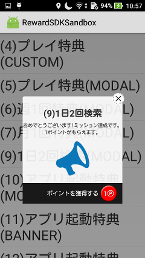
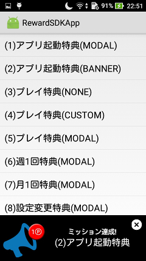
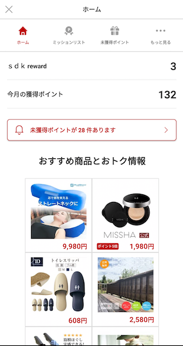
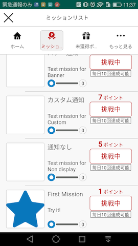
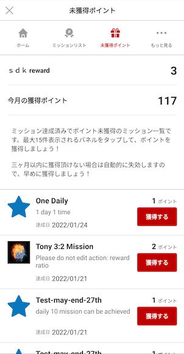
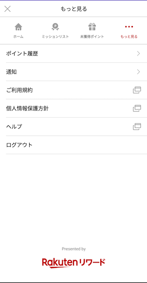
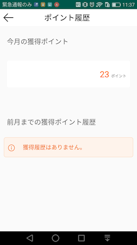

[トップ](../README.md#top)　>基本ガイド

---
# SDKの初期化
楽天リワードSDKを利用するにははじめに初期化が必要です(SDKユーザーの基本データを取得します)
SDKの機能を利用するのにはRakutenRewardクラスのメソッドを利用します

```kotlin
RakutenReward.token = "<accesstoken>"
RakutenReward.appCode = "<AppCode>"  // Example anAuY28ucmFrdXRlbi5yZXdhcmQuYW5kcm9pZC1sRUdqNEhETS1pdXNZbWRLT2JVRGFLVV9fQ0ZLd2lacg==

```

| パラメータ名        | 説明           
| --- | --- 
| appCode | アプリケーションキー (楽天リワードSDKの開発者ポータルより取得) 
| token | API-C アクセストークン(楽天リワードSDK APIへの接続用) |

セッションは Activity onStart メソッドで開始されます  
SDKを初期化するにはいくつかの方法があります


### 1 RakutenRewardLightBaseActivity を拡張した Activity クラスを作る
```kotlin
class YourActivity : RakutenRewardBaseActivity {}
```

### 2 Android のライフサイクル上でメソッドをコールする
```kotlin
class YourActivity : Activity() {

    override fun onCreate(savedInstanceState: Bundle?) {
        super.onCreate(savedInstanceState)
        RakutenRewardLifecycle.onCreate(this)
    }

    override fun onStart() {
        super.onStart()
        RakutenRewardLifecycle.onStart(this)
    }

    override fun onDestroy() {
        super.onDestroy()
        RakutenRewardLifecycle.onDestroy()
    }
}
```


### 3 AndroidX ライフサイクルイベントをバインドする
```kotlin
class YourActivity : AppCompatActivity() {

    override fun onCreate(savedInstanceState: Bundle?) {
        super.onCreate(savedInstanceState)
        RakutenRewardManager.bindRakutenRewardIn(this, this)
    }

}
```

この方法で行うためには Activity に LifecycleOwner を実装する必要があります

## IDSDKを使う
1. ID SDKを使ってログインをする
2. Get Access token from CAT API　CATよりアクセストークンを取得する
3. リワードSDKに上記のアクセストークンをセットする
4. SDK初期化する

このSDKを利用するにはID SDKの利用が必須です(2020/01)

このSDKではUser SDKでのログインもサポートしております(2020/06)。  
詳細に関しましては、SDKの担当にお問い合わせください。

---
# ミッションの達成
ミッションを達成するには、開発者はアクションAPIをコールします  
ミッション達成後、ミッション達成UIが表示されます

## アクションを送信する
```kotlin
RakutenReward.logAction("<actionCode>", {}, {})
```
actionCode は開発者ポータルより取得します

## ミッション達成UI
ユーザーがミッションを達成すると、下記のようなミッション達成UIが表示されます  
楽天リワードではモーダルとバナーを用意しております

     

### ミッション達成UIの種類
楽天リワードSDKは4つの種類のミッション達成の種類があります  
モーダル、バナー、UIなし、カスタム  
これらの設定は開発者ポータルから設定できます

| ミッション達成UIの種類        | 説明
| --- | ---
| モーダル | モーダルUIを表示する
| バナー | バナーUIを表示する
| カスタム | 開発者が自由にUIを作成できます
| UIなし | UIを表示しません

## 楽天リワードSDKポータル
ユーザーにリワードサービスの情報(ミッションや進捗、ポイントなど)を伝えるために  
楽天リワードSDKではポータルというのを提供しております  
このポータルを表示するにはポータル表示のAPIを呼ぶ必要があります

こちらがSDKポータルのイメージになります











---
言語 :
> [](../../basic/README.md)
