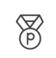
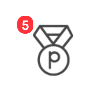
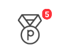
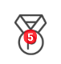
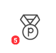
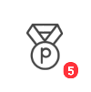

[トップ](../README.md#top)　>　[基本ガイド](./README.md)　>　SDK 用意するUI     

--- 
 
# SDK 用意するUI  
リワードSDKがいくつ用意するUI提供する。こちらのUI使用する場合、`rewardsdknative-ui`をインポートしてください。  

## 楽天リワードSDKポータル  
ユーザーにリワードサービスの情報(ミッションや進捗、ポイントなど)を伝えるために  
楽天リワードSDKではポータルというのを提供しております  
このポータルを表示するにはポータル表示のAPIを呼ぶ必要があります  

```kotlin
RakutenReward.openSDKPortal()
```  
<details>
    <summary>JAVA</summary>  

```java
RakutenRewardExtensionKt.openSDKPortal(RakutenReward.INSTANCE);
```
</details>  

### ポータルが閉じたイベント  
[](/doc/history/README.md#version-240)  
このポータル表示のAPIがポータルを表示したかどうかの結果を返します

ポータルを閉じたイベントを知る必要がある場合、このAPIを呼んで、特定のリクエストコードを提供してください。  
```kotlin
val success: Boolean = RakutenReward.openSDKPortal(101)
```
ポータルを閉じたイベントが onActivityResult で取得できます  
```kotlin
override fun onActivityResult(requestCode: Int, resultCode: Int, data: Intent?) {
    super.onActivityResult(requestCode, resultCode, data)
    if (requestCode == 101) {
        // handle SDK Portal closed event here
    }
}
```  

[](https://github.com/rakuten-ads/Rakuten-Reward-Native-Android/releases/tag/rel_20221202_v3_4_2)  
Androidx Activity Result APIを使っている新しいAPIを提供する。

以下のAPIを使って、`ActivityResultCallback<ActivityResult>`を提供してください。  
```kotlin
val success: Boolean = RakutenReward.openSDKPortal {
    // handle SDK Portal closed event here
}
```  
<details>
    <summary>JAVA</summary>  

```java
boolean success = RakutenRewardExtensionKt.openSDKPortal(RakutenReward.INSTANCE, result -> {
    // handle SDK Portal closed event here
});
```
</details>  
<br>  
こちらがSDKポータルのイメージになります

  

  


<br>  

## リワードボタン  
リワードSDKポータルをアクセスに公式ボタンです。   

このボタン使用する場合、layout XML に追加してください。  
```xml
<com.rakuten.gap.ads.mission_ui.ui.reward.RewardButton
    android:layout_width="60dp"
    android:layout_height="60dp"
    app:badge_position="top_right"
    app:button_style="dark"
    app:show_badge="true" 
    />
```  
### XML属性
* badge_position  
> Related Method: `setBadgePosition(BadgePosition)`  
* button_style  
> Related Method: `setButtonStyle(RewardButtonStyle)`  
* show_badge  
> Related Method: `setBadgeVisible(bool)`  

### 公開メソッド  
| Method                                         | Details                                    |
|------------------------------------------------|--------------------------------------------|
| setBadgePosition(position: BadgePosition)      | Set badge position                         |
| setBadgeVisible(visible: Boolean)              | Set unclaimed number badge visible setting |
| setButtonStyle(buttonStyle: RewardButtonStyle) | Set reward button style                    |
| setCustomImage (@DrawableRes resourceId: Int)  | Set custom button image                    |  

#### RewardButtonStyle  
| RewardButtonStyle |            Dark            |            Light             |
|:------------------|:--------------------------:|:----------------------------:|
| Sample            |  |  |  

#### BadgePosition  
| BadgePosition |             TOP_LEFT              |              TOP_RIGHT              |             CENTER             |               BOTTOM_LEFT               |               BOTTOM_RIGHT                |
|:--------------|:---------------------------------:|:-----------------------------------:|:------------------------------:|:---------------------------------------:|:-----------------------------------------:|
| Sample        |  |  |  |  |  |        

<br>  

---
言語 :
> [](../../basic/SdkPortal.md)