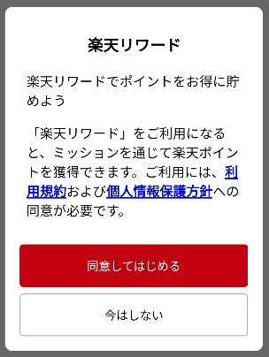

[トップ](../README.md#top)　>　利用規約への同意について

コンテンツ
* [概要：利用規約同意を取得する](#概要利用規約同意を取得する)<br>
* [既設APIの変更](#既設apiの変更) <br>
    * [USER_NOT_CONSENT ステータス](#user_not_consent-ステータス) <br>
    * [新たな RakutenRewardListener 関数](#新しい-rakutenrewardlistener-関数) <br>
* [利用規約への同意をリクエストする API](#利用規約への同意をリクエストする-api)
* [通知バナーを表示する](#通知バナーを表示する)  
* [サンプルの使用例](#サンプルの使用例)
    * [いつ利用規約への同意をリクエストする](#いつ利用規約への同意をリクエストする)
    * [アクションを送信する](#アクションを送信する)
* [テストに関する](#テストに関する)

---

# 概要：利用規約同意を取得する
Reward SDKでは新たに、利用規約同意を取得するUIをご用意しました。<br>
Reward SDKの機能を使う前に、ユーザーがRewardの利用規約および個人情報保護方針へのご同意が必須となります。<br>
このページはこのUI及び機能を利用するための方法と、既存のAPIの変更点についてご説明します。<br>
<br><br>

# 既設APIの変更
## USER_NOT_CONSENT ステータス
新たにUSER_NOT_CONSENT Reward SDK ステータスを導入しました。[RakutenRewardStatus](../APIReference/README.md#rakutenrewardsdkstatus) <br>
ユーザーがまだ利用規約に同意していない場合に、`USER_NOT_CONSENT` ステータスは `RakutenRewardListener#onSDKStatusChanged` に返します。<br>


## 新しい RakutenRewardListener 関数
新たな関数が [RakutenRewardListener](../APIReference/README.md#rakutenrewardlistener) に加わりました。<br>
利用規約同意ダイアログを閉じた場合、この `RakutenRewardListener#onSDKConsentClosed()` の実装を呼び出します。
<br><br>

# 利用規約への同意をリクエストする API
利用規約への同意をリクエストする以下のAPIをご利用いただけます。

```kotlin
RakutenReward.requestForConsent { status ->
    // check consent status
}
```
ユーザーがまだ、利用規約に同意していない場合に、同意ダイアログを表示します。



ユーザーの反応によって、以下のステータスを得られます。

| RakutenRewardConsentStatus | 説明 |
| --- | --- |
| CONSENT_PROVIDED | 同意しました |
| CONSENT_NOT_PROVIDED | 同意していません |
| CONSENT_FAILED | APIエラーが発生しました |
| CONSENT_PROVIDED_RESTART_SESSION_FAILED | 同意しましたが、SDKセッションの再開に失敗しました |

ユーザーがすでに利用規約を同意していた場合、ダイアログを表示せずに`CONSENT_PROVIDED`ステータスがコールバックに返します。
<br><br>  

# 通知バナーを表示する 
ユーザーがまだ利用規約を同意していない場合通知バナーを表示するAPIを追加した。  

```kotlin
RakutenReward.showConsentBanner {
    // check consent status
}
```

  

ユーザーが上のバナーをタップして、同意ダイアログを表示される。  
ユーザーがすでに利用規約を同意していた場合、バナーを表示せずに`CONSENT_PROVIDED`ステータスがコールバックに返します。
<br><br>

# サンプルの使用例
## いつ利用規約への同意をリクエストする
`RakutenReward.requestForConsent()` を呼ばない場合、同意ダイアログを表示しません。<br>
アプリ開発者は、いつ同意ダイアログを表示するのか？を決定します。

> `RakutenReward.openSDKPortal()` API は、利用規約に同意していない場合を処理<br>

```kotlin
class SampleActivity : RakutenRewardBaseActivity() {

    override fun onSDKStatusChanged(status: RakutenRewardSDKStatus) {
        if (status == RakutenRewardSDKStatus.USER_NOT_CONSENT) {
            // SDKステータスは USER_NOT_CONSENT の場合、このAPIを呼ば出してユーザーに利用規約への同意をリクエストする
            RakutenReward.requestForConsent()
        }
    }
}
```

## アクションを送信する
このコード スニペットはアクションを送信する。

```kotlin
fun logMissionAction() {
    RakutenReward.logAction("action1", {}) {}
}
```

利用規約への同意がない場合、このAPIは失敗となります。 <br>
次のコード スニペットは、この状況を処理します。

```kotlin
fun logMissionAction() {
    RakutenReward.requestForConsent { status ->
        if (status == RakutenRewardConsentStatus.CONSENT_PROVIDED) {
            RakutenReward.logAction("action1", {}) {}
        }
    }
}
```

まだ同意がない場合、ダイアログを表示します。その後、ユーザーが同意した際にアクションを送信します。

ユーザーがすでに利用規約を同意していた場合でも、`RakutenReward.requestForConsent()`APIを呼び出せます。ダイアログを表示せずに、`CONSENT_PROVIDED`ステータスがコールバックに返します。

# テストに関する
この機能はまだ有効になっていません。開発段階でこの機能をテストしたい場合、[ここ](https://confluence.rakuten-it.com/confluence/x/8Hx3sw)でチケットをテスト アカウントの Easy ID を提供して作成してください。  

---
言語 :
> [](../../consent/README.md)