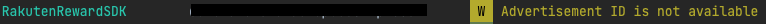
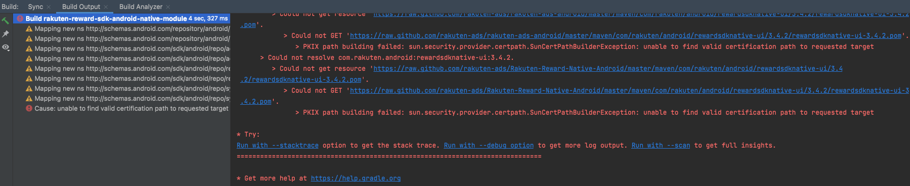
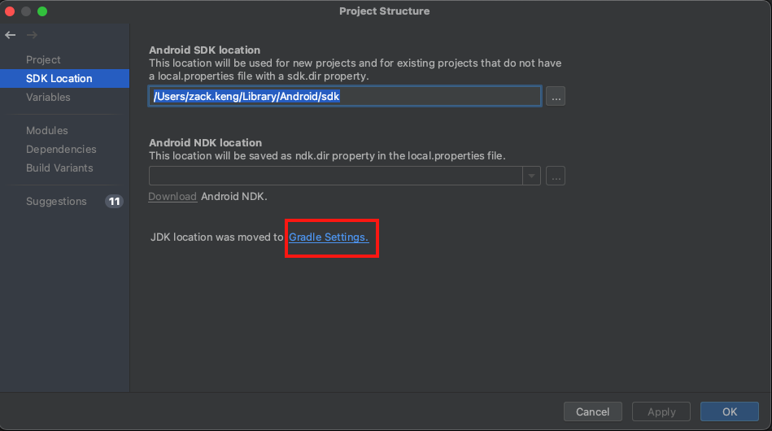
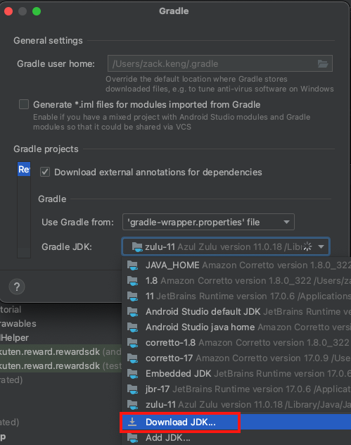
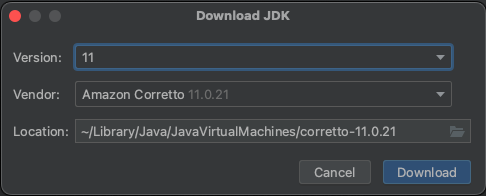
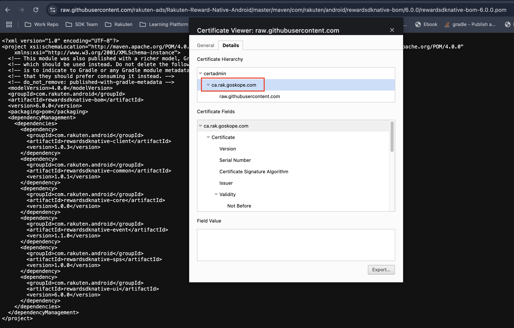
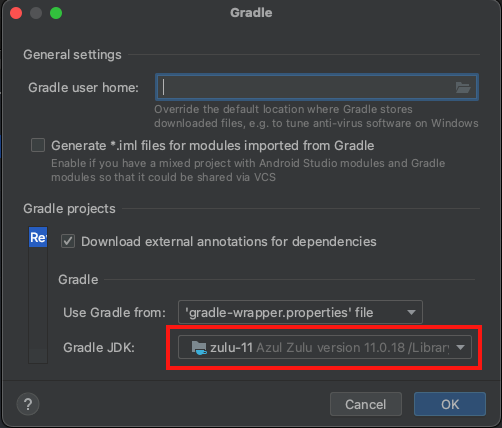
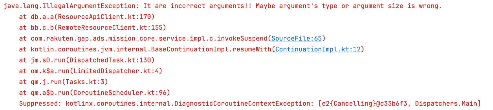

[TOP](../README.md#top)　>　FAQ

コンテンツ
* [一般](#一般)
    * [Reward SDKはJAVAまたはKotlinで書かれていますか？私のアプリケーションは完全にJAVAで書かれていますが、Reward SDKを使用するのに問題はありますか？](#reward-sdkはjavaまたはkotlinで書かれていますか私のアプリケーションは完全にjavaで書かれていますがreward-sdkを使用するのに問題はありますか)
    * [開発/テストのためにステージング環境にアクセスできますか？](#開発テストのためにステージング環境にアクセスできますか)
    * [Reward SDKはエンドユーザーの広告ID（ADID）を収集しますか？](#reward-sdkはエンドユーザーの広告idadidを収集しますか)
    * [エンドユーザーの広告ID（ADID）の収集をオプトアウトする方法は？](#エンドユーザーの広告idadidの収集をオプトアウトする方法は)  
    * [ビルドエラー - 要求されたターゲットへの有効な証明パスが見つかりません](#ビルドエラー---要求されたターゲットへの有効な証明パスが見つかりません)  
    * [Reward SDKバージョン6.1.0を統合しましたが、難読化を有効にするとアプリがクラッシュします。](#reward-sdkバージョン610を統合しましたが難読化を有効にするとアプリがクラッシュします)
* [ログイン関連](#ログイン関連)
    * [Rakuten Authログインとは何ですか？](#rakuten-authログインとは何ですか)
    * [RID / RAEログインオプションを使用していますが、ユーザーがログアウトしたときに `RakutenAuth.logout` APIを呼び出す必要がありますか？](#rid--raeログインオプションを使用していますがユーザーがログアウトしたときに-rakutenauthlogout-apiを呼び出す必要がありますか)
    * [`RakutenAuth.openLoginPage` APIは`Fragment`クラスで呼び出すことができますか？](#rakutenauthopenloginpage-apiはfragmentクラスで呼び出すことができますか)
* [実装関連](#実装関連)
    * [APIが常に`SDKNOTACTIVE`エラーを返します。原因は何ですか？](#apiが常にsdknotactiveエラーを返します原因は何ですか)
    * [毎日アプリを起動するミッションがあります。どのように実装すればよいですか？](#毎日アプリを起動するミッションがありますどのように実装すればよいですか)
    * [カスタム通知UIをどのように実装できますか？](#カスタム通知uiをどのように実装できますか)
    * [ミッションが達成された後、どのようにミッションをクレームしますか？](#ミッションが達成された後どのようにミッションをクレームしますか)
    * [`onSDKStatusChanged`や`onUnclaimedAchievement`をどのように実装しますか？](#onsdkstatuschangedやonunclaimedachievementをどのように実装しますか)
    * [SDKポータルが閉じられたイベントを検出することは可能ですか？](#sdkポータルが閉じられたイベントを検出することは可能ですか)
    * [`RakutenReward.setRaeToken` / `RakutenReward.setRIdToken`を使用してトークンを設定した後も、SDKのステータスがオフラインのままです。](#rakutenrewardsetraetoken--rakutenrewardsetridtokenを使用してトークンを設定した後もsdkのステータスがオフラインのままです)  
* [BOM](#bom)  
    * [BOMを使用する必要がありますか？](#bomを使用する必要がありますか)  
    * [BOMで指定されたバージョンとは異なるライブラリバージョンを使用するにはどうすればよいですか？](#bomで指定されたバージョンとは異なるライブラリバージョンを使用するにはどうすればよいですか)  
    * [BOMは自動的にすべてのライブラリをアプリに追加しますか？](#bomは自動的にすべてのライブラリをアプリに追加しますか)

---
# FAQ

## 一般 

### Reward SDKはJAVAまたはKotlinで書かれていますか？私のアプリケーションは完全にJAVAで書かれていますが、Reward SDKを使用するのに問題はありますか？
<details>
    <summary>回答</summary>
Reward SDKは完全にKotlinで書かれています。

Reward SDKはJAVAもサポートしていますが、APIの呼び出しにいくつかの違いがあるかもしれません。

詳細については[こちら](../java/README.md)を参照してください。

</details>

<br>

### 開発/テストのためにステージング環境にアクセスできますか？
<details>
    <summary>回答</summary>
いいえ、現在、開発者向けにステージング環境は提供していません。開発/テストには開発モードまたはテストアカウントを使用してください。

</details>

<br>

### Reward SDKはエンドユーザーの広告ID（ADID）を収集しますか？
<details>
    <summary>回答</summary>
はい、Reward SDKはユーザーの広告ID（ADID）を収集します。 

Reward SDKは広告の最適化のためにADIDを使用します。  

</details>

<br>

### エンドユーザーの広告ID（ADID）の収集をオプトアウトする方法は？
<details>
    <summary>回答</summary>
Reward SDKはGoogle Playライブラリの広告識別子を使用してユーザーのADIDを収集します。ユーザーのADIDの収集を停止するには、以下の変更を加えてください：

`app/build.gradle` ファイルに以下を追加して、広告識別子ライブラリを削除します。
```groovy
implementation ('com.rakuten.android:rewardsdknative-ui:x.x.x') {
    exclude group: 'com.google.android.gms', module: 'play-services-ads-identifier'
} 
```

`AndroidManifest`ファイルに以下を追加して、ADIDの権限を無効にします。
```xml
<uses-permission 
    android:name="com.google.android.gms.permission.AD_ID"
    tools:node="remove" />
```

Reward SDKがユーザーのADIDを収集しなくなったことを確認するには、以下のログをチェックしてください：



</details>

<br>

### ビルドエラー - 要求されたターゲットへの有効な証明パスが見つかりません  
Reward SDKの依存関係をインポートする際にビルドエラーが発生しました。このエラーを解決する方法は？ 
  

<details>
    <summary>回答</summary>  

この問題を解決するためのアプローチは2つあります。  

<details>
    <summary>1. Gradle JDKを更新する</summary>

Android StudioでGradle JDKを更新する方法   
1. プロジェクト構造を開く:  
    * File > Project Structureを選択し、Gradle Settingsをクリックします。  
  

2. JDKを選択する:  
    * デフォルトのAndroid Studio JDKを使用しないでください。他のJDKがある場合は、そのJDKを選択します。ない場合は、新しいJDKをダウンロードしてください。 
  
  

3. 新しいJDKを選択する:  
    * 新しいJDKをダウンロードした後、そのJDKバージョンを選択してOKをクリックします。    

4. Gradleプロジェクトを再同期する:  
    * Gradleがプロジェクトを再同期するのを待ちます。  

これで、Gradle JDKの更新が完了し、ビルドエラーが解決されるはずです。  

</details>

<details>
    <summary>2. CA証明書をインポートする方法</summary>

ステップ1: CA証明書をダウンロードする  
1. CA証明書をダウンロードする:  
    * ブラウザで以下のリンクを開きます: https://raw.githubusercontent.com/rakuten-ads/Rakuten-Reward-Native-Android/master/maven/com/rakuten/android/rewardsdknative-ui/3.4.2/rewardsdknative-ui-3.4.2.pom  
    * Google Chromeでリンクを開き、ロックアイコンをクリックしてCA証明書をダウンロードします。     
  

ステップ2: CA証明書をJAVAトラストストアにインポートする  
1. Android Studio Gradle JDKの場所を確認する:  
    * Android Studioを開き、File > Project Structure > SDK Locationに移動します。   
  

2. スクリプトを実行する:  
    * `JDK-location`は上記で確認したJDKのパスです。以下のコマンドを実行します：  
```bash
cd <JDK-location>/Contents/Home
```  

3. 証明書をJAVAトラストストアにインポートする:  
    * `cert-path`はダウンロードしたCA証明書のパスです。以下のコマンドを実行します：      
```bash
./bin/keytool -importcert -keystore lib/security/cacerts -storepass changeit -file <cert-path> -alias "github_cert"
```  

4. 証明書をトラストストアに受け入れる:  
    * 証明書をトラストストアに受け入れた後、Android Studioを再起動し、Gradleを再同期します。  

これで、CA証明書のインポートが完了し、ビルドエラーが解決されるはずです。  

</details>  

上記のアプローチのどちらも問題を解決しない場合は、開発チームに連絡してください。   
</details>  

### Reward SDKバージョン6.1.0を統合しましたが、難読化を有効にするとアプリがクラッシュします。  
  
以下のSDKバージョンは、上記の例外の影響を受けます：  
* 6.1.0  
* 6.2.0  
* 7.0.0

この問題はSDKバージョン7.0.1で修正されています。    
<details>
    <summary>回答</summary>  
    
SDKバージョンをアップグレードできない場合は、以下のルールを`proguard-rules.pro`ファイルに追加してください。  

```  
-keep class com.rakuten.gap.ads.mission_remote.** { *; }
```  

</details>

## ログイン関連

### Rakuten Authログインとは何ですか？
<details>
    <summary>回答</summary>
RakutenAuthログインオプションは、サードパーティ向けのものです。例えば、Rakutenの外部アプリで、RakutenのログインSDK（RIDまたはRAE）を使用していないアプリが対象です。そのため、これらのアプリはRakutenAuthログインオプションを使用できます。  

もしあなたのアプリがすでにRakutenのログインSDKを使用している場合、このログインオプションを使用する必要はありません。 

</details>

<br>

### RID / RAEログインオプションを使用していますが、ユーザーがログアウトしたときに `RakutenAuth.logout` APIを呼び出す必要がありますか？
<details>
    <summary>回答</summary>  
Reward SDKバージョン<strong>3.1.1</strong>以降を使用している場合、どのログインオプションを使用しているかに関わらず、トークンとデータを適切にクリアするためにログアウトAPIを呼び出す必要があります。  

```kotlin
RakutenAuth.logout(object : LogoutResultCallback {
    override fun logoutSuccess() {
        //logout completed
    }

    override fun logoutFailed(e: RakutenRewardAPIError) {
        //logout failed
    }
})
```

</details>

<br>

### `RakutenAuth.openLoginPage` APIは`Fragment`クラスで呼び出すことができますか？
<details>
    <summary>回答</summary>  

はい、`Fragment`クラスでAPIを呼び出すことができます。`Fragment`インスタンスを提供することで、`onActivityResult`が`Fragment`クラス内でトリガーされます。  

サンプル実装
```kotlin
class TestLoginFragment : Fragment() {
    companion object {
        private const val LOGIN_REQ_CODE = 533
    }
     
    private fun login() {
        // Fragmentインスタンスを提供してログインページを開く
        RakutenAuth.openLoginPage(this, LOGIN_REQ_CODE)
         
        // これはActivityクラス内でonActivityResultがトリガーされる
        // RakutenAuth.openLoginPage(requireActivity(), LOGIN_REQ_CODE)
    }
 
    override fun onActivityResult(requestCode: Int, resultCode: Int, data: Intent?) {
        super.onActivityResult(requestCode, resultCode, data)
        if (requestCode == LOGIN_REQ_CODE) {
            if (resultCode == RESULT_OK) {
                RakutenAuth.handleActivityResult(data, object : LoginResultCallback {
                    override fun loginSuccess() {
                        // login success
                    }
 
                    override fun loginFailed(e: RakutenRewardAPIError) {
                        Toast.makeText(requireContext(), "Login Failed", Toast.LENGTH_SHORT).show()
                    }
                })
            } else {
                Toast.makeText(requireContext(), "Login Cancelled", Toast.LENGTH_SHORT).show()
            }
        }
    }
}
```

</details>

<br>

## 実装関連

### APIが常に`SDKNOTACTIVE`エラーを返します。原因は何ですか？
<details>
    <summary>回答</summary>

このエラーは、Reward SDKがまだ開始されておらず、データの同期が行われていないことを意味します。  

まず、Applicationクラスで初期化APIが呼び出されているか確認し、提供されたApp Keyが正しいかどうかを確認してください。  
``` kotlin
RakutenReward.init(<AppKey>)
```
>**\*バージョン3.3.0以降では、手動での初期化は不要になりました。**
>
>アプリケーションのAndroidManifest.xmlに`App Key`を以下のように設定してください：
>```xml
><application>
>    <!-- Reward SDK Application Key -->
>    <meta-data
>        android:name="com.rakuten.gap.ads.mission_core.appKey"
>        android:value="{Application Key}"/>
></application>
>```

次に、APIを呼び出すActivityクラスが、[こちら](../basic/README.md#activity-と紐づけてsdk機能をアクティブにする)のオプションのいずれかを使用してSDKを開始しているか確認してください。  

上記の設定が正しく行われている場合、APIを呼び出す前にSDKのステータスが`ONLINE`に変更されるのを待ちます。ステータスの変更は以下のメソッドでトリガーされます：  
```kotlin
override fun onSDKStatusChanged(status: RakutenRewardSDKStatus) {
    if (status == RakutenRewardSDKStatus.ONLINE) {
        // SDKがアクティブになりました。ここでAPIを呼び出します。
    }
}
```
</details>

<br>

### 毎日アプリを起動するミッションがあります。どのように実装すればよいですか？
<details>
    <summary>回答</summary>

ユーザーがアプリを起動するたびにミッションのアクションコードをログに記録するには、まずSDKのステータスが`ONLINE`に変更されるのを待つ必要があります。これは、Reward SDKがデータを同期するために時間が必要なためです。   

ステータスの変更は以下のメソッドでトリガーされます：  
```kotlin
override fun onSDKStatusChanged(status: RakutenRewardSDKStatus) {
    if (status == RakutenRewardSDKStatus.ONLINE) {
        RakutenReward.logAction(<ActionCode>, {
            // アクションのログ記録に成功
        }) {
            // アクションのログ記録に失敗
        }
    }
}
```
</details>

<br>

### カスタム通知UIをどのように実装できますか？  
<details>
    <summary>回答</summary>
例えば、ミッションAは3回のアクションログが必要です。

```kotlin
RakutenReward.logAction(<ActionCode>, {
    // アクションのログ記録に成功
}) {
    // アクションのログ記録に失敗
}
```
上記の`logAction` APIが3回成功すると、ミッションAが達成され、`RakutenRewardListener`の`onUnclaimedAchievement`メソッドがトリガーされます。  

カスタムUIを表示するためのサンプル実装  
```kotlin
override fun onUnclaimedAchievement(achievement: MissionAchievementData) {
    if (achievement.custom // 通知タイプがCUSTOMかどうかを確認
        && RakutenRewardConfig.isUiEnabled() // ユーザーがUI設定を有効にしているかどうかを確認
    ) {
        // メインスレッドでカスタムUIを表示
    }
}
```

</details>

<br>

### ミッションが達成された後、どのようにミッションをクレームしますか？  
<details>
    <summary>回答</summary>  

クレームAPIは`MissionAchievementData`オブジェクトで利用できます。   

```kotlin
achievement.claim({
    // クレーム成功
}) {
    // クレーム失敗
}
```

`MissionAchievementData`オブジェクトを取得する方法は2つあります。  

1つ目は、ユーザーがCUSTOM通知タイプのミッションを達成したときに`onUnclaimedAchievement`がトリガーされる場合です。  

```kotlin
override fun onUnclaimedAchievement(achievement: MissionAchievementData) {
    if (achievement.custom // 通知タイプがCUSTOMかどうかを確認
        && RakutenRewardConfig.isUiEnabled() // ユーザーがUI設定を有効にしているかどうかを確認
    ) {
        // メインスレッドでカスタムUIを表示し、以下を呼び出してミッションをクレーム
        achievement.claim({
            // クレーム成功
        }) {
            // クレーム失敗
        }
    }
}
```

2つ目は、未クレームアイテムを取得するAPIを呼び出す方法です。  

```kotlin
RakutenReward.getUnclaimedItems({ unclaimList ->
    unclaimList[0].claim({
        // クレーム成功
    }) {
        // クレーム失敗
    }
}) {
    // 未クレームアイテムの取得に失敗
}
```

</details>

<br>

### `onSDKStatusChanged`や`onUnclaimedAchievement`をどのように実装しますか？
<details>
    <summary>回答</summary>

`onSDKStatusChanged`や`onUnclaimedAchievement`は、`RakutenRewardListener`のメソッドです。`RakutenRewardListener`の新しいオブジェクトを作成し、各メソッドに対する実装を提供します。  

```kotlin
val listener = object : RakutenRewardListener {
    override fun onUnclaimedAchievement(achievement: MissionAchievementData) {
        // ユーザーがミッションを達成しました。これは主にCUSTOM通知タイプに使用されます。
    }
 
    override fun onUserUpdated(user: RakutenRewardUser) {
        // ユーザーデータが更新されました
    }
 
    override fun onSDKStatusChanged(status: RakutenRewardSDKStatus) {
        // Reward SDKのステータスが変更されました
    }
 
    override fun onSDKClaimClosed(
        missionAchievementData: MissionAchievementData,
        status: RakutenRewardClaimStatus
    ) {
        // クレームビューが閉じられました
    }
}
```  
次に、リスナーオブジェクトを追加または削除するために以下のAPIを呼び出します。メモリリークを防ぐために、リスナーを削除するAPIが必要です。  

```kotlin
override fun onResume() {
    RakutenReward.addRakutenRewardListener(listener)
    super.onResume()
}
 
override fun onPause() {
    super.onPause()
    RakutenReward.removeRakutenRewardListener(listener)
}
```
> :grey_exclamation:  **`RakutenRewardBaseActivity`を使用してSDKを開始している場合、上記の手順は不要です。`RakutenRewardBaseActivity`クラスが既にこれを処理しているため、必要なメソッドをオーバーライドして独自の実装を提供するだけで済みます。**

</details>

<br>

### SDKポータルが閉じられたイベントを検出することは可能ですか？
<details>
    <summary>回答</summary>

はい、SDKポータルが閉じられたイベントを検出することは可能です。`openSDKPortal` APIに一意のリクエストコードを提供し、SDKポータルが閉じられたときに`onActivityResult`がトリガーされます。  

サンプル実装  

```kotlin
class SampleActivity : RakutenRewardBaseActivity() {
    companion object {
        private const val UNIQUE_REQ_CODE = 478
    }
 
    override fun onCreate(savedInstanceState: Bundle?) {
        super.onCreate(savedInstanceState)
        RakutenReward.openSDKPortal(UNIQUE_REQ_CODE)
    }
 
    override fun onActivityResult(requestCode: Int, resultCode: Int, data: Intent?) {
        if (requestCode == UNIQUE_REQ_CODE) {
            // SDKポータルが閉じられたイベントを処理
        } else {
            super.onActivityResult(requestCode, resultCode, data)
        }
    }
}
```
> :grey_exclamation:  **`RakutenReward.openSDKPortal()` APIは`Fragment`クラスでも呼び出すことができますが、`onActivityResult`は`Fragment`クラスの親アクティビティでトリガーされます。**

</details>

<br>

### `RakutenReward.setRaeToken` / `RakutenReward.setRIdToken`を使用してトークンを設定した後も、SDKのステータスがオフラインのままです。  
<details>
    <summary>回答</summary>
トークンを設定した後、以下のAPIを呼び出して手動でSDKセッションを開始する必要があります。 <br>
<code>RakutenReward.startSession()</code><br><br>

サンプル実装  

```kotlin
class SampleActivity : RakutenRewardBaseActivity() {
    ....

    private fun setToken() {
        RakutenReward.setRaeToken("token")
        // このAPIはv3.4.2以降で利用可能です
        RakutenReward.startSession()
    }
}
```
</details>  
<br>

## BOM  

### BOMを使用する必要がありますか？    
<details>
    <summary>回答</summary>  
 
いいえ。各依存関係のバージョンを手動で追加することもできます。ただし、BOMを使用することをお勧めします。これにより、すべての最新の安定バージョンを同時に使用することが容易になります。   
</details>  

<br>  

### BOMで指定されたバージョンとは異なるライブラリバージョンを使用するにはどうすればよいですか？  
<details>
    <summary>回答</summary>  

BOMで指定されたバージョンを上書きするために、希望するライブラリバージョンを指定することができます。   
</details>   

<br>  

### BOMは自動的にすべてのライブラリをアプリに追加しますか？  
<details>
    <summary>回答</summary>  
いいえ。実際にReward Nativeライブラリをアプリに追加して使用するには、各ライブラリをgradleファイルの個別の依存関係として宣言する必要があります。   

BOMを使用することで、アプリ内のReward Nativeライブラリのバージョンが互換性があることが保証されますが、BOM自体はこれらのライブラリをアプリに追加しません。  
</details>  

---
言語 :
> [](../../faq/README.md)   