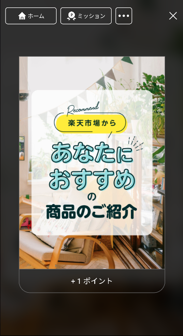
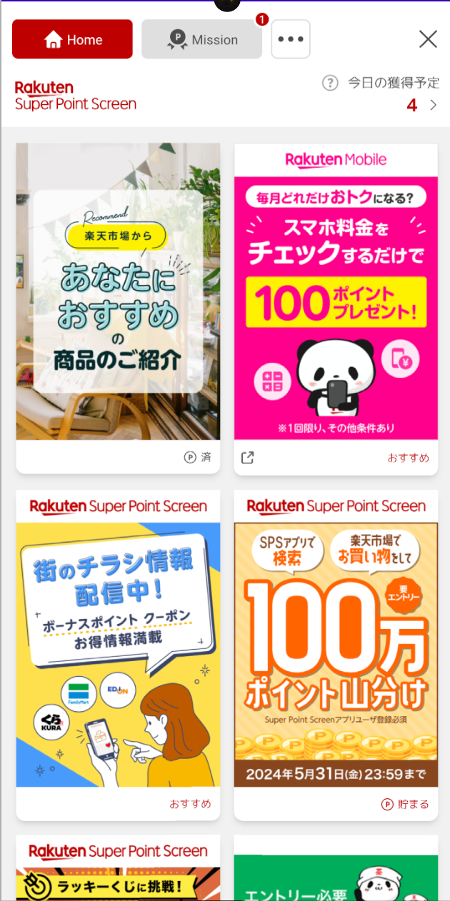
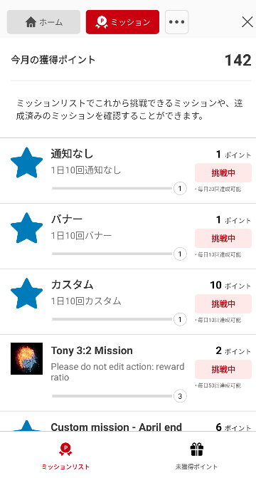
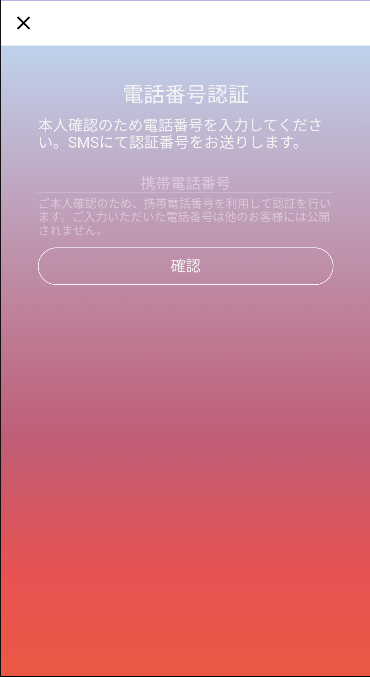
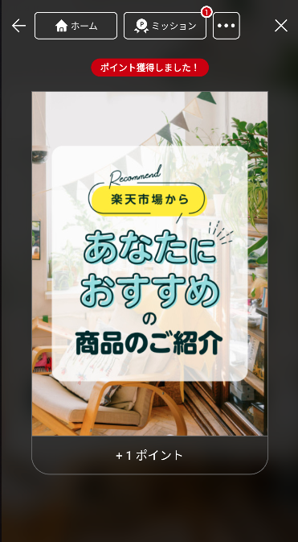
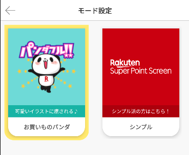
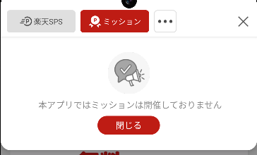
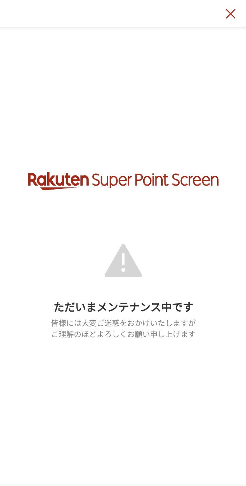

[TOP](../../README.md#top) > SPS feature  

Table of Contents  
* [Overview](#overview)  
* [Import SPS library](#import-sps-library)  
* [Enable SPS feature](#enable-sps-feature)  
* [Authentication](#authentication)  
    * [ID SDK](#id-sdk)  
* [Initialize SPS](#initialize-sps)  
* [Show SPS Portal](#show-sps-portal)  
* [Claim Point Screen](#claim-point-screen)  
* [Theme Setting Screen](#theme-setting-screen)  
* [Maintenance Screen](#maintenance-screen)  
* [Migration Guide](#migration-guide)
    * [7.2.0](#migrate-to-720)

---  

# Overview  
Mission SDK provides a new feature which integrate Super Point Screen (SPS) Ad.  

# Import SPS Library  
Add maven repository to the settings.gradle or project-level build.gradle  
**settings.gradle**
```groovy
dependencyResolutionManagement {
    repositories {
        // ...
        maven { url 'https://artifactory.rakuten-it.com/sps-android-sdk-mvn-release/' }
    }
}
```  
**build.gradle**
```groovy  
allprojects {
    repositories {
        // ...
        maven { url 'https://artifactory.rakuten-it.com/sps-android-sdk-mvn-release/' }
    }
}
```

Then add the SPS dependency to the app-level build.gradle file  
```groovy
dependencies {
  // Import the BoM for the Reward Native platform
  implementation platform('com.rakuten.android:rewardsdknative-bom:7.4.0')

  // Mandatory libraries to support SPS library
  implementation 'com.rakuten.android:rewardsdknative-core' 
  implementation 'com.rakuten.android:rewardsdknative-ui' 

  // Declare the library for SPS feature
  implementation 'com.rakuten.android:rewardsdknative-sps' 
}
```  

# Enable SPS feature
In order to use the SPS feature in Mission SDK, please ask SPS BU to enable the feature for your application.  

# Authentication  
Due to Mission SDK and SPS have different system for authentication, so we can't share the same token among two SDKs.  
Please follow the instruction below according to the authentication options the client app is using.  

## Login Option
SPS feature is required to use Rakuten ID SDK. Please check with the developer team for the neccessary configuration update.    
<br>  

# Initialize SPS  
Initialize SPS feature with the following API  
```kotlin
RakutenMissionSps.init("platform-name") {
    // request exchange token
    ...
    SpsCompatToken.CatExchange(tokenValue = exchangeToken)
}
```  
Please check with SPS team regarding the `platform-name`.  

# Show SPS Portal  
The following API will display SPS Portal as shown below.   
  

```kotlin
RakutenReward.openSpsPortal("<rzCookie>", { result ->
   when (result) {
      is Failed -> // Failed to open Portal. Get the error here `result.error`
      is Success -> // SDK Portal opened successfully
  }
}) {
    // handle portal closed event
}
```  
Below are the possible error code returned
| RakutenRewardAPIError | Reason |
| --- | --- |
| SDKNOTACTIVE | Reward SDK is not initialized yet |  
| USER_NOT_CONSENT | User haven't agree on TOS |  
| NOTSUPPORT | SPS feature is not enabled (Please inform SDK developer) |  
| NETWORKERROR | Network calls failed or user closed registration screen |
| INVALIDREQUEST | No context reference to open the Activity class. Please refer [here](../basic/README.md#to-start-sdk-in-your-activity-we-provide-several-waysk) to start SDK session  |
| UNDER_MAINTENANCE | SPS feature is under maintenance (added in v7.3.1) |

***Since 7.3.0 rz cookie parameter is added to `openSpsPortal` for better personalized experience in the portal***  

Screenshots of the SPS Portal  

    

## Non-SPS member
If the logged in user is not a SPS member, a member registration screen will be shown first.  

  

# Claim Point Screen  
Importing this SPS library will update the Claim Point screen as well.  
Below is a screenshot of the new screen.  
   

# Theme Setting Screen
In the SPS Portal settings screen, users are able to set their desire theme.   
  
Currently we support 2 themes: 
| Mission Theme |
| --- |
| Panda |
| Simple |

If your application also provide theme options and would like to sync the selected theme, you can implement the listener to SDK.    
```kotlin
RakutenMissionSps.setSpsMissionListener(object: SpsMissionListener {
    override fun onThemeChanged(theme: MissionTheme) {
        // it will be triggered when user changed the theme in the Mode settings screen
    }
})
```  

You can call the following API to sync the theme setting from your application to Mission SDK.  
```kotlin
// set to Okaimono Panda theme
RakutenRewardConfig.setTheme(MissionTheme.Panda)

// or set to Simple theme
RakutenRewardConfig.setTheme(MissionTheme.Simple)
```  

# Opt Out Mission Feature  
If your application is not intended to use any mission features, use the following API to opt out of mission features.  
```kotlin  
// set true to opt out. By default the value is false
RakutenRewardConfig.setOptOutMissionFeatures(true)
```  
  
  

# Maintenance Screen 
Since v7.4.0 when SPS service is under maintenance, users will not be able to access the SPS feature and a maintenance page will be shown. 




<br/>

# Migration Guide  
## Migrate to 7.2.0  
In version 7.2.0, `RakutenMissionSps` class is refactored to be `object` class. So `RakutenMissionSps.INSTANCE` variable is not available anymore.  
| AS-IS | TO-BE |
|---|---|
| RakutenMissionSps.INSTANCE.setPlatform() | RakutenMissionSps.setPlatform() |
| RakutenMissionSps.INSTANCE.setSpsMissionListener() | RakutenMissionSps.setSpsMissionListener() |
| RakutenMissionSps.INSTANCE.setLocation() | RakutenMissionSps.setLocation() |  
